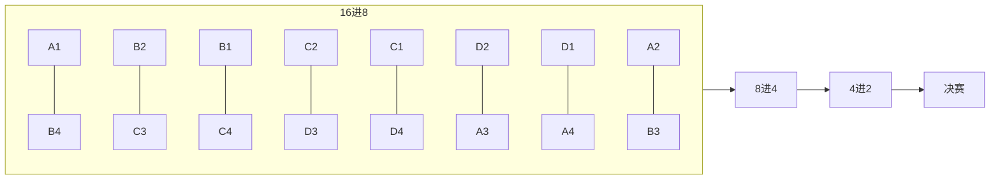

# 竞技场高级赛 — 功能点梳理

> **程序主文档**：本文自包含，无需对照 docx 即可开发与验收。继承现网「纷乱的群殴」；L1 tournament_bracket。
> 生成时间：2026-07-06 10:16 UTC

## 0. 阅读说明

> **程序主文档：本文自包含，无需对照原始策划案即可开发与验收。**
> 继承规则：决斗开启、判定、晋级、奖励发放、领先/落后动效 → 沿用现网「纷乱的群殴」，本次只改分组/报名/竞猜/商店/界面入口。
> 字段：P-xx → 字段映射.md；**禁止自创未确认字段名。**

---

### L1 系统基底

| 项 | 说明 |
|----|------|
| L1 Skill | `tournament_bracket`（`skills/frameworks/tournament_bracket/`） |
| Workflow | `workflows/arena.workflow.json` |
| 继承原则 | L1 已有规则标注「继承 tournament_bracket」；本项目差异写 **L2 delta** |
| 配置开关 | `extension_slots: betting,shop`（workflow skill_configs） |
| L1 测试基线 | `tournament_bracket/qa.md`：T-TB-001~003、B-TB-001、E-TB-001 → 见验收场景.md |

---

### 文档约定

| 原则 | 说明 |
|------|------|
| 一级目录 = 功能点 | 规则写全，禁止「见原始文档」 |
| 正文引用 | 写功能点名称或界面名称，不写模糊引用 |
| 每章标准块 | 涉及模块 → 功能点 → 数据来源 → 怎么实现 → 程序实现分工 |
| 字段引用 | P-xx 编号，在字段映射.md 统一定义 |

### 功能点导航

| 编号 | 功能点名称 |
|------|------------|
| 4.1 | 赛区组成 |
| 4.2 | 十六强签位表（固定，不可随机） |
| 4.3 | 对阵树数据结构（建议） |
| 4.4 | 机器人填充规则 |
| 4.5 | 对战与晋级（继承现网） |
| 5.1 | 活动阶段与倒计时 |
| 6.1 | 竞猜积分 |
| 6.2 | 竞猜币 |
| 7.1 | 整体布局 |
| 7.2 | Bracket 视觉排布（16 人单败） |
| 7.3 | 节点状态机 |
| 7.4 | 新增入口汇总 |
| 7.5 | 选手 vs 观众（对阵树内） |
| 10.1 | 参与规则 |
| 10.2 | 界面流程 |
| 10.3 | 竞猜主界面 |
| 10.4 | 押注弹窗 |
| 10.5 | 竞猜记录 |
| 10.6 | 战斗信息可见性（与「选手 vs 观众」表一致） |
| 11.1 | 锦标赛商店 |

### 名词定义

| 名词 | 含义 |
|------|------|
| 周练组 | 竞技场周练排行榜上的一个小组，格式「XX赛区·第N组」 |
| 赛区（锦标赛） | 同一联赛+档位下的4个周练组合并为一个锦标赛赛区 |
| 小组排名 | 该玩家在本周练组内的名次（1起） |
| A/B/C/D组 | 赛区内4个周练组的代号；Ax=A组第x名 |
| 选手/观众 | 组内1–4名=选手；5名及以后=观众 |
| 轮次 | 16进8→8进4→半决赛→决赛，共4轮 |

### 七日活动日程

| 日期 | 阶段名 | 选手 | 观众 | 竞猜积分 |
|------|--------|------|------|----------|
| 第1天 | 公示 | 查看身份/对阵预览；不可战斗 | 查看身份/对阵；不可竞猜 | — |
| 第2天 | 十六进八 | 战斗日 | 开放竞猜（本轮） | UTC0发200 |
| 第3天 | 八进四 | 战斗日 | 开放竞猜（本轮） | UTC0发200 |
| 第4天 | 半决赛 | 战斗日 | 开放竞猜（本轮） | UTC0发200 |
| 第5天 | 决赛 | 战斗日 | 开放竞猜（本轮） | UTC0发200 |
| 第6–7天 | 结算 | 发放战斗/锦标赛奖励；积分1:1转竞猜币；积分清零 | 同左 | 不再发放 |

### 选手 vs 观众 全局行为矩阵

| 维度 | 选手（组内1–4名） | 观众（组内5名+） |
|------|-------------------|------------------|
| 资格来源 | 前一周周练组榜1–4；周一UTC0自动确定；无主动报名 | 前一周周练组榜5+ |
| 第1天（公示） | 可查看身份与对阵预览；不可开打 | 可查看身份与对阵；不可竞猜 |
| 【前往】 | 进入决斗界面 | 进入对阵树界面 |
| 对阵树顶栏 | 奖励统计：钻石+五档进度(P-28) | 竞猜引导文案 |
| 对阵树「你的决斗」Tab | 可切换使用 | 点击弹出Tips：无决斗信息 |
| 决斗界面 | 可进入；进行中可见双方战斗积分 | 不可进入 |
| 战斗积分可见性 | 决斗进行中：双方积分可见 | 结算前不可见；结算后通过战报查看 |

### 界面跳转

```
[主界面活动入口] → [活动展示弹窗]
  ├── 【前往】+ 选手 → [决斗界面]
  │     ├── 商店 → [锦标赛商店 11.1]
  │     └── 竞猜 → [竞猜主界面 10.3]
  └── 【前往】+ 观众 → [对阵树（锦标赛Tab）]
        ├── 已结束节点 → [战斗记录弹窗]
        ├── 进行中节点 → [竞猜主界面（定位场次）]
        ├── 商店 → [锦标赛商店 11.1]
        └── 竞猜（全量） → [竞猜主界面 10.3]
              ├── Tab=竞猜 → [押注弹窗 10.4]
              └── Tab=记录 → [竞猜记录 10.5] → [战斗记录弹窗]
```

## 4. 赛区组成

### 涉及模块

| 模块 | 本功能点在此的表现 |
|------|-------------------|
| RegistrationService | 周一 UTC0 自动报名后触发赛区划分 |
| BracketService | 每赛区独立生成一棵对阵树（P-10） |
| BettingService | 每赛区独立竞猜池（80 人均可参与） |
| 活动展示 / 对阵树 / 竞猜 | 玩家仅见所属赛区数据 |

> **继承 tournament_bracket R-TB-003**（L2 实例化：`groups_per_bracket=4`，80 人/赛区）

### 功能点

| 规则 | 内容 |
|------|------|
| 赛区单元 | 相同 **联赛 + 档位（P-01）** 下的 **4 个周练组（P-03）** 合并为一个锦标赛赛区 |
| 人数 | **80 人** = **16 选手** + **64 观众** |
| 选手来源 | 各周练组组内排名 **1–4 名（P-06）** → 选手（P-07=1） |
| 观众来源 | 各周练组组内排名 **5 名及以后** → 观众（P-07=2） |
| 组代号 | 4 组依次记为 **A、B、C、D**；**Ax** = A 组第 x 名（x=1..4 为选手） |
| 独立性 | 每赛区 **独立淘汰赛、独立冠军、独立竞猜池** |
| 触发时机 | **周一 UTC0 自动报名完成时**，服务端批量完成赛区划分并生成签位（联动 4.2） |
| 划分逻辑 | 遍历所有（联赛 ID, 档位 ID）组合 → 取同组合下 4 个周练组 → 写入一个 Bracket |

### 数据来源

| 读写 | 业务数据 | 程序字段 | 用途 |
|------|----------|----------|------|
| 读 | 联赛档位 | P-01 | 赛区聚合键 |
| 读 | 周练组归属 | P-03 | 确定玩家所属小组（「XX 赛区 · 第 N 组」） |
| 读 | 组内排名 | P-06 | 身份判定（1 起） |
| 写 | 选手/观众身份 | P-07 | 入口分流、UI 差异、门控 |
| 写 | 对阵树快照 | P-10 | 赛区签位与节点状态 |

### 怎么实现

#### 通用

- 赛区划分与自动报名、签位生成在同一事务内完成；任一失败则整事务回滚。
- 玩家整期归属同一赛区，身份（P-07）7 日内不变；下周一 UTC0 重新报名时覆盖。
- 客户端所有锦标赛相关界面只展示玩家所属赛区的 P-10 与竞猜数据。

#### 服务端

```
周一 UTC0 定时任务:
  for (leagueId, tierId) in 所有(联赛, 档位)组合:
    groups = 取该组合下 4 个周练组  // groups_per_bracket=4
    contestants = 各组 P-06 in [1..4]  // 共 16 人
    spectators  = 各组 P-06 >= 5      // 共 64 人
    创建 Bracket(80人) → 写 P-07 → 调用签位生成(4.2) → 写 P-10
```

- 继承 R-TB-003 概念；L2 delta 为固定 4 组 × 20 人/组 = 80 人明细。
- 组代号 A/B/C/D 按周练组在赛区内序号映射，用于 4.2 固定签位表。

#### 客户端

- 活动展示弹窗读取 P-07 展示「选手 / 观众」身份。
- 【前往】分流：选手 → 决斗界面；观众 → 对阵树界面（见 7.5）。
- 对阵树、竞猜、战报均带赛区 ID 参数，只渲染本赛区 Bracket。

### 程序分工

| 事项 | 客户端 | 服务端 | 备注 |
| 赛区划分算法 | — | ✓ | 继承 R-TB-003 |
| 身份写入 P-07 | ✓ 展示 | ✓ 批量写入 | 联动 R-011 |
| 签位联动 | — | ✓ | 划分后立即 4.2 |
| 入口分流 | ✓ | ✓ 可选校验 | P-07 |
| 跨赛区隔离 | ✓ 读本地赛区 ID | ✓ 数据隔离 | 独立竞猜池 |

---

## 4. 十六强签位表（固定，不可随机）

### 涉及模块

| 模块 | 本功能点在此的表现 |
|------|-------------------|
| BracketService | 按固定表写入 16 叶节点及后续轮次父节点 |
| 对阵树界面 | 客户端按签位顺序渲染 Bracket（见 7.2） |
| MatchService | 每场对战绑定 matchId / round / matchIndex |

> **继承 tournament_bracket R-TB-004**（`bracket_size=16`，签位不可随机）

### 功能点

**第一轮（16 进 8）8 场对阵——签位固定如下：**

| 场次 | 左位 | 右位 | 说明 |
|------|------|------|------|
| M1 | A1 | B4 | 种子保护：1 vs 4 |
| M2 | B2 | C3 | 交叉 |
| M3 | B1 | C4 | 种子保护 |
| M4 | C2 | D3 | 交叉 |
| M5 | C1 | D4 | 种子保护 |
| M6 | D2 | A3 | 交叉 |
| M7 | D1 | A4 | 种子保护 |
| M8 | A2 | B3 | 交叉 |

- **同组规避**：M1–M8 中无同周练组内战（A 与 A 不直接对阵，B 与 B 不直接对阵…）。
- **种子保护**：每组第 1 名（x1）对阵其他组第 4 名（y4）。

**第二轮（8 进 4）：**

| 场次 | 对阵 |
|------|------|
| QF1 | Winner(M1) vs Winner(M2) |
| QF2 | Winner(M3) vs Winner(M4) |
| QF3 | Winner(M5) vs Winner(M6) |
| QF4 | Winner(M7) vs Winner(M8) |

**第三轮（4 进 2 半决赛）：**

| 场次 | 对阵 |
|------|------|
| SF1 | Winner(QF1) vs Winner(QF2) |
| SF2 | Winner(QF3) vs Winner(QF4) |

**第四轮（决赛）：**

| 场次 | 对阵 |
|------|------|
| F1 | Winner(SF1) vs Winner(SF2) → 冠军 |

**推进路径示意：**



- 填充顺序：按 M1→M8 顺序写入叶子节点；胜者按上表向父节点推进。
- 不足 16 选手时按 **4.4 机器人填充规则** 补满叶节点，**不改变签位表结构**。

### 数据来源

| 读写 | 业务数据 | 程序字段 | 用途 |
|------|----------|----------|------|
| 读 | 组代号映射 | P-03 + 赛区内序号 | A/B/C/D 与 Ax 解析 |
| 读 | 选手池 | P-06、P-07 | 叶节点 slotLeft/slotRight |
| 写 | 对阵树快照 | P-10 | 15 节点完整树（8+4+2+1） |

### 怎么实现

#### 通用

- 签位表为**常量/配置表**，服务端生成时**禁止随机打乱**。
- 生成后与 R-022 同组规避、种子保护校验一致；校验失败则回滚报名事务。
- 客户端只读 P-10 渲染，不参与签位计算。

#### 服务端

```
报名事务内:
  解析赛区 4 组 → 映射 A/B/C/D
  for i in [M1..M8]:
    写叶节点 round=1, matchIndex=i, slotLeft/slotRight 按上表
  预创建 QF/SF/F 父节点（slot 初始为空，status=PENDING）
  不足 16 人 → 4.4 机器人填充空缺叶位
  写入 P-10 → 提交事务
```

- 每场结束：胜者 ID 写入 `parentMatchId` 对应父节点 slotLeft 或 slotRight（继承 R-TB-005）。

#### 客户端

- 读 P-10 按 7.2 倒金字塔排布；叶节点顺序与 M1–M8 一致。
- 未定轮次显示 `?`；已结束轮次显示胜/负标识。

### 程序分工

| 事项 | 客户端 | 服务端 | 备注 |
| 固定签位表常量 | — | ✓ | 继承 R-TB-004 |
| 叶节点填充 | — | ✓ | M1–M8 |
| 同组/种子校验 | — | ✓ | 生成后 assert |
| 机器人补位联动 | — | ✓ | 4.4 |
| Bracket 渲染 | ✓ 读 P-10 | ✓ 下发快照 | 7.2 |

---

## 4. 对阵树数据结构（建议）

### 涉及模块

| 模块 | 本功能点在此的表现 |
|------|-------------------|
| BracketService | 生成、维护、推送 BracketSnapshot |
| 对阵树界面 | 读 P-10 渲染 15 个 BracketNode |
| MatchService | 按 matchId 调度单场对战 |
| PushGateway | BracketUpdatePush 增量/全量更新节点 |

> **继承 tournament_bracket BracketNode 骨架**；P-10 为 L2 字段编号

### 功能点

- 每个赛区 **一棵树**，共 **15 个节点**（8 + 4 + 2 + 1）。
- 节点字段（业务语义，程序字段名【待程序补充】）：

| 字段（业务） | 类型/枚举 | 说明 |
|--------------|-----------|------|
| matchId | int | 全局唯一场次 ID |
| round | int | 1=16进8, 2=8进4, 3=半决赛, 4=决赛 |
| matchIndex | int | 该轮场次序号（如 M1=1 … M8=8） |
| slotLeft / slotRight | int | 选手 ID 或机器人 ID；0=未定 |
| winnerId | int | 胜方 ID；0=未定 |
| status | enum | PENDING / IN_PROGRESS / COMPLETED |
| isRobotLeft / isRobotRight | bool | 对应 slot 是否为机器人 |
| scoreLeft / scoreRight | int | 展示用结算分（非进行中实时分） |
| parentMatchId | int | 父节点 matchId（胜者上推目标） |

- **填充顺序**：按 4.2 表 M1→M8 写入叶子节点；每场结束胜者写入父节点对应 slot。
- **状态流转**：PENDING → IN_PROGRESS（轮次到达）→ COMPLETED（战斗结束）；详见 7.3。

**BracketNode 结构示例：**

```json
{
  "matchId": 101,
  "round": 1,
  "matchIndex": 1,
  "slotLeft": 10001,
  "slotRight": 10002,
  "winnerId": 0,
  "status": "PENDING",
  "isRobotLeft": false,
  "isRobotRight": true,
  "scoreLeft": 0,
  "scoreRight": 0,
  "parentMatchId": 201
}
```

### 数据来源

| 读写 | 业务数据 | 程序字段 | 用途 |
|------|----------|----------|------|
| 读/写 | 对阵树快照 | P-10 | 含全部 BracketNode 数组 |
| 读 | 选手/机器人 ID | 【待程序补充】 | slotLeft/slotRight |
| 读 | 活动阶段 | P-14 关联 phase | 节点 IN_PROGRESS 触发 |
| 读 | 已押注标记 | P-27 | 节点按钮显隐（7.3） |

### 怎么实现

#### 通用

- P-10 为服务端权威快照；客户端不本地推算胜者或签位。
- 签位生成与 P-10 初始写入在同一报名事务内完成。
- 节点 status 与活动阶段（5.1）、对战结果（4.5）保持一致。

#### 服务端

- `BracketService` 维护 BracketSnapshot；接口：`GetBracketSnapshot`（C→S 拉取）、`BracketUpdatePush`（S→C 推送变更）。
- 阶段切换时：当前轮全部叶节点/对局节点 → IN_PROGRESS；上一轮全部 COMPLETED 后方可切换（见 5.1）。
- 战斗结束：`MatchService` 回调 → 写 winnerId、scoreLeft/Right、status=COMPLETED → 胜者 ID 写入 parentMatchId 父节点 slot。

#### 客户端

- 进入对阵树时拉取 P-10；订阅 BracketUpdatePush 刷新变更节点。
- 按 round + matchIndex 映射到 7.2 视觉位置；COMPLETED 节点显示战报入口，IN_PROGRESS 显示竞猜入口（7.3）。

### 程序分工

| 事项 | 客户端 | 服务端 | 备注 |
| BracketNode 结构定义 | ✓ 解析 | ✓ 权威存储 | 继承 tournament_bracket |
| 初始树生成 | — | ✓ | 4.2 + 4.4 |
| 晋级写入父节点 | — | ✓ | 继承 R-TB-005 |
| 快照拉取/推送 | ✓ | ✓ | GetBracketSnapshot |
| 节点状态机渲染 | ✓ | ✓ status 驱动 | 7.3 |

---

## 4. 机器人填充规则

### 涉及模块

| 模块 | 本功能点在此的表现 |
|------|-------------------|
| BracketService | 叶节点不足 16 时生成机器人并写入 P-10 |
| MatchService | 机器人不参与真实战斗；晋级由规则判定 |
| 对阵树 / 决斗 / 战报 | 展示机器人头像、鸟力、结算分 |

> **继承 tournament_bracket R-TB-004**（`robot_fill=true`）

### 功能点

| 条件 | 行为 |
|------|------|
| 真实选手 < 16 | 用机器人补满 16 个叶节点 |
| 机器人展示 | 有头像、鸟力（展示用，统一或随机） |
| 机器人战斗 | **不参与真实战斗** |
| 机器人 vs 真人 | 真人自动胜出（晋级判定） |
| 机器人 vs 机器人 | 随机一方以更高积分晋级 |
| 机器人积分系数 | 以低于真实玩家 **20%** 的积分参与比较 |
| 机器人展示分 | 取本轮真实玩家最低分 × **20%～30%** 区间内随机（UI 展示用） |

- 机器人填充**不改变** 4.2 固定签位表结构，仅替换空缺 slot 的选手 ID。
- 填充在报名 + 签位生成事务内完成；写 P-10 时标记 `isRobotLeft` / `isRobotRight`。

### 数据来源

| 读写 | 业务数据 | 程序字段 | 用途 |
|------|----------|----------|------|
| 读 | 赛区实际选手数 | 【待程序补充】 | 计算 robotCount = 16 - 实际数 |
| 读 | 本轮真实玩家最低分 | 【待程序补充】 | 机器人展示分基准 |
| 写 | 对阵树快照 | P-10 | isRobot*、displayScore |
| 读 | 单场结果 | 沿用现网 | 真人 vs 机器人判定 |

### 怎么实现

#### 通用

- 机器人仅用于**填满 Bracket** 与**晋级路径完整性**；不影响真人玩家的对战体验。
- 客户端对机器人与真人使用相同头像位 UI，可通过 isRobot 标记决定是否显示特殊标识（可选，默认与真人一致）。

#### 服务端

```
if 赛区实际选手数 < 16:
    robotCount = 16 - 实际选手数
    minRealScore = 本轮所有真人玩家最低结算分
    for each 空缺叶节点:
        生成 robotId（isRobot=true）
        展示鸟力 = 配置范围内随机
        展示分 = random(minRealScore × 0.20, minRealScore × 0.30)
        写入 slotLeft 或 slotRight

对战结算:
    if 一方 isRobot and 一方真人 → winner = 真人
    if 双方 isRobot → winner = 随机一方（高展示分晋级）
    if 双方真人 → 走现网 MatchService 最高分判定
```

- 机器人不参与 MatchService 真实战斗调度；到轮次截止时由服务端直接产出 COMPLETED 结果。

#### 客户端

- 读 P-10 渲染机器人头像、鸟力；不发起机器人侧战斗请求。
- 战报弹窗展示机器人 scoreLeft/scoreRight（展示分，非实时战斗分）。

### 程序分工

| 事项 | 客户端 | 服务端 | 备注 |
| 机器人生成与填充 | — | ✓ | 签位事务内 |
| 展示分计算 | — | ✓ | 最低分 ×20%–30% |
| 机器人晋级判定 | — | ✓ | 不经过真实战斗 |
| 机器人 UI 展示 | ✓ 读 P-10 | ✓ isRobot 标记 | 头像+鸟力 |
| 真人战斗 | 沿用现网 | 沿用现网 MatchService | 4.5 |

---

## 4. 对战与晋级（继承现网）

### 涉及模块

| 模块 | 本功能点在此的表现 |
|------|-------------------|
| MatchService | 异步对战调度、计分、单场结算（**沿用现网「纷乱的群殴」**） |
| BracketService | 接收胜方 ID，写入父节点，推进 P-10 |
| 决斗界面 | 选手发起战斗、查看实时积分 |
| TournamentScheduler | 轮次切换前校验上一轮全部 COMPLETED |

> **继承 tournament_bracket R-TB-005**；L2 **delta**：签位来源改为 4.2 固定表 + 4.4 机器人

### 功能点

| 项 | 规则 |
|----|------|
| 对战形式 | 异步；各比单局无尽模式**最高分** |
| 决斗/晋级/奖励 | **完全沿用现网「纷乱的群殴」MatchService 逻辑** |
| 本次改动（delta） | 仅签位生成（4.2）、机器人（4.4）、竞猜/商店；**不重写战斗判定** |
| 签位一致性 | 16 强签位与 4.2 完全一致（8 场首轮 → 4 → 2 → 1） |
| 机器人 | 不足 16 人按 4.4 补位；机器人不参与真实战斗 |
| 赛区独立 | 每赛区独立冠军，互不影响 |
| 同组规避 | 首轮无同周练组内战；种子 1 号对其它组 4 号 |
| 动效 | 领先/落后/晋级/奖励档位/选手结算奖 **维持现网表现** |

- 第 1 天（公示期 ANNOUNCE）：选手不可发起战斗（见 5.1 门控）。
- 观众不可进入决斗界面；战斗积分可见性见 7.5。

### 数据来源

| 读写 | 业务数据 | 程序字段 | 用途 |
|------|----------|----------|------|
| 读/写 | 对阵树快照 | P-10 | 节点 status、winnerId |
| 读 | 选手/观众 | P-07 | 战斗入口门控 |
| 读 | 对战鸟力 | P-29 | 决斗界面实时展示 |
| 读 | 选手奖励进度 | P-28 | 决斗/对阵树奖励条 |
| 读 | 单场对战 | 沿用现网协议 | MatchService 调度 |

### 怎么实现

#### 通用

- **不重写**决斗核心：开局、计分、结算、晋级、五档奖励仍走现网 MatchService。
- 每场真人 vs 真人结束 → MatchService 产出胜方与结算分 → BracketService 写 P-10 父节点。
- 机器人场次按 4.4 规则由 BracketService 直接结算，不进入 MatchService。

#### 服务端

```
// delta 对接点（其余沿用现网）
签位来源: 4.2 固定表 + 4.4 机器人 → 写入 P-10 叶节点
每场结束回调:
    winnerId → 写入 parentMatchId 对应父节点 slotLeft/slotRight
    node.status = COMPLETED
    BracketUpdatePush

// 沿用现网 MatchService（不重写）
异步对战 → 单局无尽最高分 → 胜方判定 → 选手奖励(P-28) → 晋级写入
```

- 轮次切换（5.1）：上一轮全部 COMPLETED 后方可进入下一 BATTLE 阶段；否则阻塞或告警（【待程序确认】超时策略）。

#### 客户端

- 决斗界面：仅选手（P-07=1）且非第 1 天可点击「战斗！」；进行中刷新双方实时战斗积分。
- 轮次结算动效（胜/负/晋级/奖励档位/选手结算奖）**沿用现网**，不新增动画规格。
- 第 1 天公示期「战斗！」置灰，与 5.1 阶段门控一致。

### 程序分工

| 事项 | 客户端 | 服务端 | 备注 |
| MatchService 核心 | **沿用现网** | **沿用现网** | 继承 R-TB-005 |
| 签位来源 delta | — | ✓ | 4.2 + 4.4 |
| 胜者写入父节点 | — | ✓ BracketService | P-10 |
| 决斗 UI 增强 | ✓ 顶栏/鸟力 | ✓ P-29 下发 | 见决斗界面功能点 |
| 公示期战斗门控 | ✓ 置灰 | ✓ 拒绝 | 5.1 |
| 观众拦截 | ✓ 路由 | ✓ 可选校验 | P-07 |

---

## 5. 活动阶段与倒计时

### 涉及模块

| 模块 | 本功能点在此的表现 |
|------|-------------------|
| TournamentScheduler | 每日 UTC0 阶段切换、定时副作用 |
| RegistrationService | 周一 UTC0 新一期自动报名 |
| BracketService / MatchService | 轮次切换前校验对战结算 |
| BettingService | 竞猜开放/关闭、轮次结算 |
| 对阵树 / 决斗 / 活动展示 | 底栏倒计时 P-14；按钮门控 |

> **继承 tournament_bracket R-TB-006**（`phase_schedule` 7 日一期）

### 功能点

**活动周期**：7 日一期；**周一 UTC0 开启**；**下周一 UTC0 进入下一期**。每日 UTC0 切阶段；所有结算、分组、发放均在 UTC0 自动执行。

| 日期 | 阶段名 | 枚举 | 选手 | 观众 | 竞猜积分 |
|------|--------|------|------|------|----------|
| 第 1 天 | 公示 | ANNOUNCE | 查看身份/对阵预览；**不可战斗** | 查看身份/对阵；**不可竞猜** | 不发 |
| 第 2 天 | 十六进八 | BATTLE_16 | 战斗日 | 开放竞猜（本轮） | UTC0 发 200 |
| 第 3 天 | 八进四 | BATTLE_8 | 战斗日 | 开放竞猜（本轮） | UTC0 发 200 |
| 第 4 天 | 半决赛 | BATTLE_4 | 战斗日 | 开放竞猜（本轮） | UTC0 发 200 |
| 第 5 天 | 决赛 | BATTLE_FINAL | 战斗日 | 开放竞猜（本轮） | UTC0 发 200 |
| 第 6–7 天 | 结算 | SETTLE | 发放战斗/锦标赛奖励；积分 1:1 转竞猜币；积分清零 | 同左 | 不再发放 |

**阶段转移（服务端权威）：**

| 当前 | 触发 | 目标 | 副作用 |
|------|------|------|--------|
| NONE | 周一 UTC0 | ANNOUNCE | 自动报名 → P-07 → 生成 P-10；推送 PhaseChangePush |
| ANNOUNCE | UTC0（第 2 天） | BATTLE_16 | 竞猜开放；发放 P-18（200）；PointsGrantPush |
| BATTLE_16 | UTC0（第 3 天） | BATTLE_8 | 16 进 8 结算 → 晋级 QF；竞猜结算；发 200 |
| BATTLE_8 | UTC0（第 4 天） | BATTLE_4 | 8 进 4 结算 → 晋级 SF；竞猜结算；发 200 |
| BATTLE_4 | UTC0（第 5 天） | BATTLE_FINAL | 半决赛结算 → 晋级 F；竞猜结算；发 200 |
| BATTLE_FINAL | UTC0（第 6 天） | SETTLE | 决赛结算 → 冠军；竞猜结算；P-16×P-20→P-21 |
| SETTLE | 下周一 UTC0 | ANNOUNCE | P-16 清零；重新报名；新对阵树 |

- **倒计时 P-14**：距下一 UTC0 阶段切换的剩余秒数；对阵树底栏、活动展示入口展示。
- **客户端门控**：公示期禁战斗/竞猜；结算期禁竞猜；服务端兜底拒绝非法请求。

### 数据来源

| 读写 | 业务数据 | 程序字段 | 用途 |
|------|----------|----------|------|
| 读 | 活动剩余时间 | P-14 | 底栏倒计时（秒级） |
| 读 | 当前阶段 | 【待程序补充】 | 门控判定 |
| 读/写 | 竞猜积分 | P-16 | 阶段切换发放/转化 |
| 读 | 发放额/轮次 | P-18、P-19 | 配表 |
| 读 | 转化比例 | P-20 | 第 6 天 SETTLE |
| 读/写 | 对阵树 | P-10 | 轮次节点 IN_PROGRESS |

### 怎么实现

#### 通用

- 服务端为阶段唯一权威源；客户端读 phase + P-14 做 UI 门控，非法操作服务端拒绝。
- 阶段切换与积分发放、竞猜结算、晋级写入在同一 UTC0 定时任务链中顺序执行。
- 离线玩家仍按时获得积分/转化；动画播放规则见 6.1 / 6.2。

#### 服务端

```
// 每日 UTC0 定时任务
func onDailyUTC0():
    phase = getCurrentPhase()
    switch phase:
        case ANNOUNCE:   transition(BATTLE_16); grantPoints(P-18); pushPhaseChange()
        case BATTLE_16:  settleAllR16(); settleBets(R16); transition(BATTLE_8); grantPoints(P-18)
        case BATTLE_8:   settleAllQF();  settleBets(QF);  transition(BATTLE_4); grantPoints(P-18)
        case BATTLE_4:   settleAllSF();  settleBets(SF);  transition(BATTLE_FINAL); grantPoints(P-18)
        case BATTLE_FINAL: settleFinal(); settleBets(FINAL); transition(SETTLE); convertPointsToCoins()
        case SETTLE:
            if isMonday(): resetP16(); startNewPeriod(); transition(ANNOUNCE)

// P-14 计算
P-14 = nextUTC0Timestamp - now()  // 秒
```

- 接口：`GetPhaseInfo`（C→S 拉 phase + P-14）、`PhaseChangePush`（S→C 推送）。

#### 客户端

```
func isActionAllowed(action):
    phase = getPhase()
    if action == FIGHT  and phase == ANNOUNCE: return false
    if action == BET    and phase == ANNOUNCE: return false
    if action == BET    and phase == SETTLE:   return false
    return true

func updateCountdown():
    display(format(P-14))  // 底栏「回合结束倒计时」
```

- 阶段变更时刷新：Bracket 节点状态、竞猜入口显隐、战斗按钮可用性、顶栏积分栏。

### 程序分工

| 事项 | 客户端 | 服务端 | 备注 |
| UTC0 阶段机 | — | ✓ TournamentScheduler | 继承 R-TB-006 |
| P-14 倒计时 | ✓ 展示 | ✓ 计算下发 | 秒级 |
| 阶段门控 | ✓ 本地判定 | ✓ 兜底拒绝 | 战斗/竞猜 |
| 切换副作用 | — | ✓ | 报名/发放/结算/转化 |
| PhaseChangePush | ✓ 订阅 | ✓ 推送 | 全界面刷新 |

---

## 6. 竞猜积分

### 涉及模块

| 模块 | 本功能点在此的表现 |
|------|-------------------|
| BettingService | 押注扣减、结算返还 P-16 |
| TournamentScheduler | 第 2–5 天 UTC0 发放；第 6 天转化前持有 |
| 对阵树 / 决斗 / 战报 / 竞猜 / 商店 | 顶栏「竞猜积分信息栏」只读展示 |
| 活动展示 | 发放动画入口 |

> **L2 delta**（`enable_betting=true` 竞猜子系统，不在 L1 tournament_bracket 内）

### 功能点

| 项 | 规则 |
|----|------|
| 用途 | 当期锦标赛竞猜押注 |
| 发放 | 第 2–5 天对应轮次：**当日 UTC0 发 200**（P-18 可配） |
| 累计 | **4 次共 800**（P-19 可配） |
| 第 1 天 | 不发 |
| 第 6–7 天 | 不再发放；第 6 天执行积分→币转化（见 6.2） |
| 期初 | **每期开始（周一 UTC0）强制清零 P-16** |
| 押注范围 | 最低 1 分，最高全部 P-16 |
| 结算 | 猜中：**2 倍**投入返还 P-16；猜错：**不返还** |
| 动画 | 每轮首次进活动界面弹发放动画；展示 **P-17 累计获得** |
| 离线 | 轮次到点仍发放；多轮未登录后**只弹一次**发放动画 |

- 竞猜积分信息栏（icon + 数量）在以下界面样式与数据一致：对阵树、决斗、战报弹窗、竞猜主/押注/记录、锦标赛商店。
- 信息栏**只读不可点**；改余额仅在押注弹窗操作。

### 数据来源

| 读写 | 业务数据 | 程序字段 | 用途 |
|------|----------|----------|------|
| 读/写 | 当期竞猜积分 | P-16 | 押注扣减、结算返还、信息栏 |
| 读 | 累计获得（展示） | P-17 | 发放动画展示 |
| 读 | 每轮发放积分额 | P-18 | 配表，默认 200 |
| 读 | 发放轮次数 | P-19 | 配表，默认 4 |
| 读 | 转化比例 | P-20 | 第 6 天转竞猜币（6.2） |
| 读 | 活动阶段 | 【待程序补充】 | 发放/押注门控（5.1） |

### 怎么实现

#### 通用

- 每期开始服务端清零 P-16；与 P-21（竞猜币）独立，竞猜币永久保留。
- 发放与转化时点与 **5.1 活动阶段** 严格对齐。
- 押注成功、竞猜结算、积分转化后推送或下次拉取刷新信息栏数量。

#### 服务端

```
第 2–5 天 UTC0:
    for player in 赛区 80 人:
        P-16 += P-18          // 默认 200
        P-17 += P-18          // 累计获得
        grant_flag = 未播放

新一期周一 UTC0:
    P-16 = 0                  // 强制清零

押注校验:
    phase in [BATTLE_16..BATTLE_FINAL]
    amount in [1, P-16]
    每轮仅 1 次（P-27）

竞猜结算:
    if bet.target == winner: P-16 += bet.amount * 2
    else: 不返还
```

#### 客户端

- 共用「竞猜积分信息栏」组件：读 P-16，7 类界面样式一致。
- 发放动画：首次进活动且 grant_flag=未播放 → 展示 P-17 → 标记已播放；多轮累积仍只播一次。
- 押注弹窗内展示 P-16 并实时扣减预览；确认后刷新信息栏。

### 程序分工

| 事项 | 客户端 | 服务端 | 备注 |
| UTC0 发放 P-18 | — | ✓ | 第 2–5 天 |
| 期初清零 P-16 | — | ✓ | 周一 UTC0 |
| 信息栏组件 | ✓ 复用 | ✓ 下发 P-16 | 7 界面 |
| 发放动画 | ✓ | ✓ grant_flag | P-17 |
| 押注扣减/结算 | ✓ 展示 | ✓ BettingService | P-16 |
| 转化联动 | — | ✓ | 6.2 第 6 天 |

---

## 6. 竞猜币

### 涉及模块

| 模块 | 本功能点在此的表现 |
|------|-------------------|
| BettingService / 账户服务 | 第 6 天积分转化写入 P-21 |
| 锦标赛商店 | 消费 P-21 兑换商品（P-31） |
| 对阵树 / 决斗 / 竞猜 | 商店入口跳转；转化动画触发 |
| TournamentScheduler | SETTLE 阶段触发转化 |

> **L2 delta**（竞猜币/商店子系统）

### 功能点

| 项 | 规则 |
|----|------|
| 用途 | 锦标赛商店兑换商品 |
| 来源 | **仅**通过竞猜积分转化（P-16 → P-21） |
| 保留 | **永久保留**，不随活动期清零 |
| 转化 | 第 6 天（SETTLE）：持有 P-16 按 **P-20（默认 1:1）** 转入 P-21；**转化后 P-16 必为 0** |
| 转化动画 | 全部比赛结束后**首次进活动界面**播放 |
| 跨期 | 当期未登录则**下期不补播**转化动画 |
| 发放时点 | 与 **5.1 七日活动日程** 一致：第 2–5 天发积分；第 6 天转化；第 1 / 第 6–7 天不发积分 |

- 竞猜积分信息栏（P-16）在商店界面同样展示；竞猜币信息栏（P-21）仅在锦标赛商店展示。
- 离线玩家结算时仍执行转化；登录后按动画规则播放。

### 数据来源

| 读写 | 业务数据 | 程序字段 | 用途 |
|------|----------|----------|------|
| 读/写 | 当期竞猜积分 | P-16 | 转化源；转化后清零 |
| 读 | 累计获得（展示） | P-17 | 与 6.1 发放动画共用 |
| 读/写 | 竞猜币余额 | P-21 | 商店消费、永久账户 |
| 读 | 发放额 / 轮次 | P-18、P-19 | 配表 |
| 读 | 转化比例 | P-20 | 第 6 天 SETTLE |
| 读 | 商店商品 | P-31 | 表驱动 |

### 怎么实现

#### 通用

- 每期开始（周一 UTC0）**仅清零 P-16**；**P-21 不变**。
- 转化与积分发放解耦：积分在第 2–5 天发放（6.1），转化仅在第 6 天 SETTLE 执行一次。
- 商店规则复用竞技场商店 UI 模板，货币换为 P-21。

#### 服务端

```
第 6 天 SETTLE（决赛已结算）:
    converted = P-16 * P-20    // 默认 1:1
    P-21 += converted
    P-16 = 0                   // 必清零
    convert_anim_flag = 未播放
    push PointsConvertPush

新一期周一 UTC0:
    P-21 保持不变              // 永久保留
    P-16 = 0                   // 期初清零（6.1）
```

#### 客户端

- 转化动画：全部比赛结束 + convert_anim_flag=未播放 + 首次进活动 → 播放 → 标记已播放。
- 锦标赛商店：顶栏展示 P-21；购买成功后刷新余额。
- 跨期未登录：下期进入不补播转化动画，但 P-21 已在服务端到账。

### 程序分工

| 事项 | 客户端 | 服务端 | 备注 |
| 第 6 天转化 | — | ✓ | P-20 |
| P-21 持久化 | ✓ 展示 | ✓ 账户 | 永久 |
| 转化动画 | ✓ | ✓ convert_anim_flag | 跨期不补播 |
| 商店消费 | ✓ UI | ✓ 扣 P-21 | P-31 |
| 积分信息栏 | ✓ 复用 | ✓ P-16 | 商店内只读 |

---

## 7. 整体布局

### 涉及模块

| 模块 | 本功能点在此的表现 |
|------|-------------------|
| 对阵树界面（锦标赛 Tab） | 本功能点主界面 |
| 「你的决斗」Tab | 选手可切换；观众 Tips |
| 竞猜 / 战报 / 商店 | 从树上网关跳转 |
| 活动【前往】 | 观众默认落点 |

> **继承现网**锦标赛 Tab 框架，叠加竞猜/商店/积分新元素

### 功能点

**框架结构（沿用现网锦标赛 Tab，叠加新元素）：**

| 区域 | 内容 |
|------|------|
| 顶栏左 | 竞猜积分信息栏（icon + 数量 **P-16**） |
| 顶栏中 | Tab：「你的决斗 - {当前轮次名}」 \| 「锦标赛」 |
| 顶栏右 | 帮助 i |
| 奖励/引导条 | 选手：「你的锦标赛奖励」+ 进度条 + 五档宝石（**P-28**）；观众：竞猜引导文案 |
| 中央 | 对阵树 Bracket（排布见 **7.2**） |
| 底栏 | 返回；**回合结束倒计时（P-14）**；右侧商店、竞猜（全量）圆形按钮 |
| 左侧 | 截图/相机（若现网有则保留） |

**组件与数据：**

| 图上标注 | 表现 | 数据 |
|----------|------|------|
| 竞猜积分信息栏 | icon + 数量 | P-16 |
| 比赛奖励统计 / 竞猜提示文本 | 选手：钻石+五档；观众：引导文案 | P-07、P-28 |
| 已下注标识 | 头像上「已下注」 | P-27 |
| 商店入口 / 竞猜入口（全量） | 右下圆形按钮 | 跳转锦标赛商店 / 竞猜主界面 |
| 竞猜入口（精确场次） | 节点下「竞猜」文字 | 跳转竞猜并定位场次 |
| 战报入口（精确场次） | 已结束节点播放 icon | 跳转战斗记录弹窗 |

**子图状态：**

| 状态 | 表现 |
|------|------|
| 已完成战斗 | 节点显示战报入口 |
| 即将开始/进行中 | 节点显示竞猜按钮 |
| 完成押注后 | 支持对象头像「已下注」标识；隐藏该轮全部竞猜按钮 |
| 观众点决斗 Tab | Tips：无决斗信息 |

### 数据来源

| 读写 | 业务数据 | 程序字段 | 用途 |
|------|----------|----------|------|
| 读 | 对阵树快照 | P-10 | 中央 Bracket |
| 读 | 竞猜积分 | P-16 | 顶栏信息栏 |
| 读 | 选手/观众 | P-07 | 顶栏差异、Tab 门控 |
| 读 | 选手奖励进度 | P-28 | 选手奖励条 |
| 读 | 已押注标记 | P-27 | 头像标签 |
| 读 | 活动剩余时间 | P-14 | 底栏倒计时 |
| 读 | 当前阶段/轮次名 | 【待程序补充】 | Tab 标题、门控 |

### 怎么实现

#### 通用

- 不重写对阵树 Tab 容器；在现网布局上**叠加**顶栏积分、奖励/引导条差异、底栏入口。
- 选手与观众共用同一布局骨架，仅顶栏奖励区与「你的决斗」Tab 行为不同（见 **7.5**）。
- 所有新增入口跳转规格见 **7.4**；节点按钮逻辑见 **7.3**。

#### 服务端

- 进入对阵树时下发：P-10、P-07、P-16、P-28（选手）、P-27、P-14、当前 phase。
- 阶段切换 Push 触发客户端全量刷新布局门控（竞猜按钮、倒计时、Tab 可用性）。

#### 客户端

```
布局层级:
  TopBar:    [P-16 信息栏] [Tab组] [帮助]
  RewardBar: if P-07==选手 → P-28 进度条 else → 竞猜引导文案
  Center:    BracketView(P-10)  // 7.2
  BottomBar: [返回] [P-14 倒计时] [商店] [竞猜全量]
```

- 「你的决斗」Tab：P-07=选手可切换；P-07=观众点击弹 Tips「无决斗信息」，不切换内容。
- 底栏倒计时每秒刷新 P-14 格式化显示。

### 程序分工

| 事项 | 客户端 | 服务端 | 备注 |
| 框架容器 | ✓ 沿用现网 | — | 锦标赛 Tab |
| 顶栏/底栏新元素 | ✓ | ✓ 数据下发 | P-16/P-14 |
| 选手/观众顶栏差异 | ✓ 读 P-07 | — | 7.5 |
| Bracket 区域 | ✓ | ✓ P-10 | 7.2 |
| 入口跳转 | ✓ | — | 7.4 |
| 阶段门控刷新 | ✓ | ✓ Push | 5.1 |

---

## 7. Bracket 视觉排布（16 人单败）

### 涉及模块

| 模块 | 本功能点在此的表现 |
|------|-------------------|
| 对阵树界面（中央区域） | BracketView 渲染 15 节点 |
| BracketService | P-10 节点 round/matchIndex 映射视觉位置 |
| 竞猜 / 战报 | 节点下挂按钮（7.3） |

> **继承 tournament_bracket** 16 人单败倒金字塔布局

### 功能点

- **树形**：倒金字塔——上方/两侧为早期轮次，**最底中为冠军位**（带王冠）。
- **节点数**：与 **4.2 签位表** 一致 — 8 场 → 4 → 2 → 1。

| 层级 | 节点数 | 表现 |
|------|--------|------|
| 16 进 8 | 左右各 4 场，共 8 场 | 每节点：头像 + 名称；失败者灰/X |
| 8 进 4 | 左右各 2 场 | 未定显示 **?** |
| 4 进 2 | 左右各 1 场 | 同上 |
| 决赛 | 底部中央 1 格 | 冠军王冠；其下可挂「竞猜」文字按钮（精确场次入口） |

- **连线**：白/浅色线连接父子节点；已完成路径可高亮。
- **M1–M8 映射**：round=1, matchIndex=1..8 按 4.2 从左到右、从上到下排布于 16 进 8 层。
- **胜者上推**：视觉位置由 parentMatchId 关联；QF/SF/F 节点在胜者产生前显示 `?` 占位。

### 数据来源

| 读写 | 业务数据 | 程序字段 | 用途 |
|------|----------|----------|------|
| 读 | 对阵树快照 | P-10 | 全部节点 slot/status/score |
| 读 | 选手信息 | 【待程序补充】 | 头像、名称 |
| 读 | 当前轮次 | 【待程序补充】 | ? 占位 vs 竞猜按钮 |
| 读 | 已押注标记 | P-27 | 头像标签 |

### 怎么实现

#### 通用

- 客户端**不做**签位计算，仅按 P-10 的 round + matchIndex 查表映射到预设坐标。
- 失败选手：灰化或 X 标识（沿用现网失败表现）。
- 未到轮次或 slot 为空：双方显示 `?`。

#### 服务端

- P-10 下发完整 15 节点；BracketUpdatePush 携带变更节点（matchId、status、winnerId、score）。
- matchIndex 与 4.2 场次编号一一对应，保证多端渲染一致。

#### 客户端

```
func layoutNode(node):
    pos = BRACKET_LAYOUT[node.round][node.matchIndex]
    if node.slotLeft == 0:  showPlaceholder("?", left)
    else:                   showPlayer(node.slotLeft, left)
    // slotRight 同理
    if node.status == COMPLETED:
        highlightPath(node.matchId → root)
    attachButtons(node)  // 7.3
```

- 决赛节点底部中央；冠军产生后显示王冠 icon。
- 支持横向滑动/缩放（若现网已有则保留）。

### 程序分工

| 事项 | 客户端 | 服务端 | 备注 |
| 布局坐标表 | ✓ 本地常量 | — | round×matchIndex |
| 节点数据 | ✓ 渲染 | ✓ P-10 | 15 节点 |
| 连线/高亮 | ✓ | — | 完成路径 |
| 签位一致性 | — | ✓ | 4.2 映射 |
| 节点按钮 | ✓ | ✓ status | 7.3 |

---

## 7. 节点状态机

### 涉及模块

| 模块 | 本功能点在此的表现 |
|------|-------------------|
| BracketService | 维护每个 BracketNode.status |
| 对阵树界面 | 按 status 渲染按钮与占位 |
| BettingService | 押注成功写 P-27，触发按钮隐藏 |
| PushGateway | BracketUpdatePush(status, winnerId) |

> **继承 tournament_bracket** BracketNodeStatus：PENDING → IN_PROGRESS → COMPLETED

### 功能点

| 状态 | 视觉 | 可点击 |
|------|------|--------|
| 未开始（PENDING） | 双方头像；无结果 | 当前轮次且未押注 → 见下 |
| 进行中（IN_PROGRESS） | 正常头像 | 节点上显示「竞猜」按钮 → 打开竞猜系统 |
| 已结束（COMPLETED） | 胜方亮 / 败方 X | 显示战报入口（播放 icon）→ 打开战斗记录弹窗 |
| 已押注（P-27） | 支持对象头像上「已下注」标签 | **隐藏该轮所有竞猜按钮** |
| 未到轮次 | ? 占位 | 无按钮 |

**状态转移：**

| 当前 | 触发 | 目标 | 副作用 |
|------|------|------|--------|
| PENDING | 轮次到达（phase 切换到该轮） | IN_PROGRESS | 显示「竞猜」；BracketUpdatePush |
| PENDING/IN_PROGRESS | 玩家押注成功 | 保持 | 写 P-27；头像「已下注」；**隐藏该轮全部竞猜按钮** |
| IN_PROGRESS | 战斗结束（胜者产生） | COMPLETED | 胜者写入父节点；竞猜结算；BracketUpdatePush |
| COMPLETED | — | 终态 | 显示战报；不再显示竞猜 |

- **战报/竞猜互斥**：同一节点只显示一种——进行中=竞猜；已结束=战报；未开始/未到轮次=隐藏。
- 15 个节点各自独立维护状态，由 P-10 统一快照下发。

### 数据来源

| 读写 | 业务数据 | 程序字段 | 用途 |
|------|----------|----------|------|
| 读/写 | 节点 status | P-10.status | 渲染分支 |
| 读/写 | 已押注标记 | P-27 | 按 matchId/轮次隐藏竞猜 |
| 读 | 活动阶段 | 【待程序补充】 | IN_PROGRESS 触发 |
| 读 | winnerId / score | P-10 | COMPLETED 展示 |

### 怎么实现

#### 通用

- 节点 status 由服务端权威驱动；客户端不本地推进状态。
- P-27 存在时，**该轮所有节点**的竞猜按钮均隐藏（不仅是已押注节点）。
- 竞猜按钮仅在 phase 为 BATTLE_* 且节点 IN_PROGRESS 时显示（5.1 门控）。

#### 服务端

```
func onPhaseChange(newPhase):
    for node in currentRoundNodes(P-10):
        node.status = IN_PROGRESS
    push BracketUpdatePush

func onMatchComplete(matchId, winnerId):
    node = P-10[matchId]
    node.status = COMPLETED
    node.winnerId = winnerId
    writeWinnerToParent(node.parentMatchId, winnerId)
    push BracketUpdatePush

func onBetSuccess(playerId, matchId, targetPlayerId):
    P-27[round] = { matchId, targetPlayerId }
```

#### 客户端

```
func renderNode(node):
    if P-27[thisRound]:  hideAllBetButtons(thisRound); showBadge(P-27)
    elif node.status == PENDING:
        if node.round == currentRound: showButton("竞猜")
        else: showPlaceholder("?")
    elif node.status == IN_PROGRESS:
        showButton("竞猜")   // 前提：无 P-27
    elif node.status == COMPLETED:
        showWinLose(); showButton("战报")
```

- 点击「竞猜」→ 竞猜主界面并带 matchId 定位场次。
- 点击「战报」→ 战斗记录弹窗（单场，只读）。

### 程序分工

| 事项 | 客户端 | 服务端 | 备注 |
| status 转移 | — | ✓ | 阶段/战斗驱动 |
| P-27 写入 | — | ✓ 押注成功 | 隐藏整轮竞猜 |
| 节点渲染 | ✓ | ✓ P-10 | 互斥逻辑 |
| BracketUpdatePush | ✓ 订阅 | ✓ 推送 | 增量/全量【待确认】 |
| 竞猜/战报跳转 | ✓ | — | 7.4 |

---

## 7. 新增入口汇总

### 涉及模块

| 模块 | 本功能点在此的表现 |
|------|-------------------|
| 对阵树界面 | 顶栏、节点、底栏全部新增入口 |
| 锦标赛商店 | 商店入口目标页 |
| 竞猜系统 | 全量/精确场次入口目标页 |
| 战报（战斗记录） | 已结束节点入口目标页 |

### 功能点

| 入口 | 位置 | 可见条件 | 行为 |
|------|------|----------|------|
| 竞猜积分栏 | 顶栏左 | 始终 | **只读 P-16**；不可点击 |
| 商店 | 右下圆形 icon | 始终 | 打开**锦标赛商店**（货币 P-21） |
| 竞猜（全量） | 右下圆形 icon | 第 2–5 天（BATTLE_*） | 打开竞猜主界面，**默认当前轮** |
| 竞猜（精确场次） | 节点下「竞猜」文字 | 节点 IN_PROGRESS 且未 P-27 | 打开竞猜主界面并**定位该 matchId** |
| 战报 | 已结束节点播放 icon | 节点 COMPLETED | 打开**战斗记录弹窗**（单场） |
| 已下注 | 头像上标签 | P-27 已存在 | **仅展示**；同时隐藏该轮全部竞猜入口 |
| 帮助 | 顶栏右 i | 始终 | 打开锦标赛帮助（翻页补充） |

- 战报与竞猜**同一节点互斥**，不会同时展示（7.3）。
- 第 1 天（ANNOUNCE）：竞猜入口置灰/隐藏；第 6–7 天（SETTLE）同理（5.1）。
- 关闭商店/竞猜/战报弹窗后回到对阵树，保持滚动位置与 Tab 状态。

### 数据来源

| 读写 | 业务数据 | 程序字段 | 用途 |
|------|----------|----------|------|
| 读 | 竞猜积分 | P-16 | 顶栏信息栏 |
| 读 | 已押注标记 | P-27 | 标签 + 隐藏竞猜 |
| 读 | 节点 status / matchId | P-10 | 精确场次/战报参数 |
| 读 | 活动阶段 | 【待程序补充】 | 竞猜入口门控 |
| 读 | 竞猜币 | P-21 | 商店页展示 |

### 怎么实现

#### 通用

- 顶栏竞猜积分栏与决斗、战报、竞猜、商店**共用同一组件**（6.1）。
- 所有跳转带赛区 ID + matchId（精确场次/战报）参数，避免跨赛区串场。
- 观众与选手入口集合相同；差异在顶栏奖励区与「你的决斗」Tab（7.5）。

#### 服务端

- 押注接口校验 phase、P-27 重复、matchId 归属当前轮 IN_PROGRESS 节点。
- 战报数据接口按 matchId 返回单场结果（【待程序补充】）。

#### 客户端

```
入口路由:
  商店 icon     → TournamentShopView(P-21)
  竞猜全量 icon → BetMainView(round=currentRound)
  节点「竞猜」  → BetMainView(matchId=node.matchId)
  节点战报 icon → BattleRecordPopup(matchId=node.matchId)

门控:
  if phase == ANNOUNCE or SETTLE: hide/disable 竞猜入口
  if P-27[currentRound]: hideAllBetButtons()
```

### 程序分工

| 事项 | 客户端 | 服务端 | 备注 |
| 积分信息栏 | ✓ 复用组件 | ✓ P-16 | 只读 |
| 商店跳转 | ✓ | ✓ 商品 P-31 | 6.2 |
| 竞猜跳转 | ✓ 带 matchId | ✓ 押注校验 | 10.x |
| 战报跳转 | ✓ 弹窗 | ✓ 单场数据 | 战报功能点 |
| P-27 反馈 | ✓ 标签+隐藏 | ✓ 写入 | 7.3 |
| 阶段门控 | ✓ | ✓ 兜底 | 5.1 |

---

## 7. 选手 vs 观众（对阵树内）

### 涉及模块

| 模块 | 本功能点在此的表现 |
|------|-------------------|
| 对阵树界面 | 顶栏差异、Tab 门控、Bracket 共用 |
| 活动展示【前往】 | 身份分流入口 |
| 决斗界面 | 仅选手可达（观众拦截） |
| 竞猜 / 战报 | 80 人均可参与竞猜；战报可见性不同 |

### 功能点

与 **0-阅读说明「选手 vs 观众 全局行为矩阵」** 一致。对阵树内补充如下：

| 维度 | 选手（组内 1–4 名，P-07=1） | 观众（组内 5 名+，P-07=2） |
|------|------------------------------|----------------------------|
| 资格来源 | 前一周周练组榜 1–4；周一 UTC0 自动确定 | 前一周周练组榜 5+ |
| 第 1 天（公示） | 可查看身份与对阵预览；不可开打 | 可查看身份与对阵；不可竞猜 |
| 【前往】 | 进入**决斗界面** | 进入**对阵树界面** |
| 对阵树顶栏 | 奖励统计：钻石 + 五档进度（**P-28**） | **竞猜引导文案**（隐藏奖励统计） |
| 对阵树「你的决斗」Tab | **可切换使用** | 点击弹出 Tips：**无决斗信息**（不切换内容） |
| 决斗界面 | 可进入；进行中可见双方战斗积分 | **不可进入** |
| 战斗积分可见性 | 决斗进行中：双方积分可见 | 结算前不可见；结算后通过**战报**查看 |
| Bracket / 底栏 | 共用同一棵树；商店、竞猜（全量）、倒计时（P-14）相同 | 同左 |
| 竞猜 | 可参与（每轮 1 次，P-27） | 可参与 |
| 轮次结算动效 | 胜/负/晋级/奖励档位/选手结算奖 **维持现网** | 同左（观众无选手结算奖） |

**对阵树内互斥逻辑（共用）：**

- Bracket 节点数与 **4.2 签位** 一致：8 场 → 4 → 2 → 1。
- 战报 / 竞猜 / 已下注：**同一节点只显示一种**——战斗中=竞猜；已结束=战报；已押注=头像标签并隐藏该轮全部竞猜按钮。
- 底栏：商店、竞猜（全量）、**P-14 倒计时**与现网锦标赛框架兼容。

### 数据来源

| 读写 | 业务数据 | 程序字段 | 用途 |
|------|----------|----------|------|
| 读 | 选手/观众身份 | P-07 | 顶栏差异、Tab、路由 |
| 读 | 对阵树快照 | P-10 | Bracket 共用渲染 |
| 读 | 竞猜积分 | P-16 | 顶栏信息栏 |
| 读 | 选手奖励进度 | P-28 | 选手顶栏奖励条 |
| 读 | 已押注标记 | P-27 | 节点标签 + 隐藏竞猜 |
| 读 | 活动剩余时间 | P-14 | 底栏倒计时 |

### 怎么实现

#### 通用

- 沿用现网锦标赛 Tab 框架，叠加顶栏积分（P-16）、底栏商店/竞猜入口、节点竞猜/战报按钮。
- 身份整期不变（7 日）；UI 分支仅读 P-07，不在客户端改写身份。
- 观众**永不**路由至决斗界面；选手可从「你的决斗」Tab 或【前往】进入决斗。

#### 服务端

- 【前往】分流由 P-07 决定目标页；可选服务端校验观众战斗请求拒绝。
- 战斗进行中积分推送仅下发给选手相关会话；观众战前不可拉取进行中实时分。
- 战报接口对已结束场次向 80 人开放（含观众）。

#### 客户端

```
// 顶栏
if P-07 == 选手:
    showRewardBar(P-28)      // 钻石 + 五档进度
else:
    showBetGuideText()       // 竞猜引导文案
    hideRewardBar()

// 「你的决斗」Tab
onClickDuelTab():
    if P-07 == 观众:
        showTips("无决斗信息")
        return
    switchToDuelTab()

// Bracket（选手/观众相同）
renderBracket(P-10)            // 7.2 + 7.3
renderEntries(P-16, P-14)      // 7.4
```

- 节点状态按 **7.3** 渲染；选手/观众在 Bracket 上看到的内容一致，差异仅在顶栏与 Tab。
- 轮次结算动效（胜/负/晋级/奖励档位/选手结算奖）**沿用现网**，不新增规格。

### 程序分工

| 事项 | 客户端 | 服务端 | 备注 |
| P-07 顶栏分支 | ✓ | ✓ 下发 | 奖励 vs 引导 |
| 观众决斗 Tab Tips | ✓ | — | 不切换内容 |
| 观众决斗拦截 | ✓ 路由 | ✓ 可选校验 | 【前往】分流 |
| Bracket 共用渲染 | ✓ | ✓ P-10 | 7.2/7.3 |
| 战斗积分可见性 | ✓ 门控 | ✓ 推送范围 | 10.6 |
| 跳转竞猜/战报/商店 | ✓ | — | 7.4 |
| 轮次结算动效 | 沿用现网 | 沿用现网 | 4.5 |

---

## 10. 参与规则

### 涉及模块

| 模块 | 本功能点在此的表现 |
|------|-------------------|
| BettingService | 押注资格校验、扣减 P-16、写 P-27、轮次结算 |
| TournamentScheduler | 阶段门控（第 2–5 天开放；第 1 天关闭） |
| 对阵树 / 决斗 | 竞猜入口显隐；已押注后隐藏该轮全部竞猜按钮 |
| 竞猜主界面 / 押注弹窗 | 规则提示与押注交互 |

> **L2 delta**（`enable_betting=true` 竞猜子系统，继承 L1 tournament_bracket 阶段骨架，规则见 R-030~R-034）

### 功能点

| 项 | 规则 |
|----|------|
| 谁可玩 | 本赛区所有玩家（16 选手 + 64 观众，共 80 人） |
| 参与资格 | `player.tournament_id == 当前赛区 ID` 即可押注 |
| 轮次对齐 | 与 knockout 轮次 1:1：16 进 8 → 8 进 4 → 半决赛 → 决赛，共 4 轮 |
| 每轮次数 | **每轮只能支持 1 名选手**（全场该轮仅 1 次押注） |
| 可选对象 | 该场对战双方之一（`targetPlayerId ∈ [match.left, match.right]`） |
| 截止时间 | 该轮结束前的 **UTC0**（即「七日活动日程表」每日阶段切换点之前） |
| 押注范围 | 最低 **1** 分，最高 = 当前持有全部 **P-16** |
| 猜中 | 获得 **2 倍** 押注积分（`P-16 += bet.amount × 2`） |
| 猜错 | **不返还** 押注积分（`bet.result = LOSE`） |
| 提示语 | 竞猜主界面展示「竞猜成功获得双倍积分」 |
| 第 1 天门控 | 公示期（ANNOUNCE）竞猜入口置灰/隐藏；服务端返回 `ERR_BET_CLOSED` |

**P-27 已押注标记（每轮 1 次的核心约束）：**

- 押注成功后服务端写入 `P-27[round] = { matchId, targetPlayerId, amount }`。
- 客户端在对阵树支持对象头像上显示「已下注」标签。
- **同时隐藏该轮所有竞猜按钮**（不仅是已押注节点）。
- 已押注后不可改选对象、不可追加押注、不可取消。

**与活动阶段的关系（5.1）：**

| 日期 | 阶段 | 竞猜 |
|------|------|------|
| 第 1 天 | ANNOUNCE | 关闭 |
| 第 2 天 | BATTLE_16 | 开放（16 进 8 轮） |
| 第 3 天 | BATTLE_8 | 开放（8 进 4 轮） |
| 第 4 天 | BATTLE_4 | 开放（半决赛轮） |
| 第 5 天 | BATTLE_FINAL | 开放（决赛轮） |
| 第 6–7 天 | SETTLE | 关闭；执行末轮结算与积分转币 |

### 数据来源

| 读写 | 业务数据 | 程序字段 | 用途 |
|------|----------|----------|------|
| 读 | 选手/观众身份 | P-07 | 80 人均可竞猜（身份不影响资格） |
| 读/写 | 当期竞猜积分 | P-16 | 押注扣减、结算返还 |
| 读/写 | 已押注标记 | P-27 | 每轮 1 次约束；树上标签 |
| 读 | 对阵树快照 | P-10 | 场次、轮次、双方 ID、胜者 |
| 读 | 活动阶段 | 【待程序补充】 | 开放/关闭门控 |
| 读 | 活动剩余时间 | P-14 | 轮次截止倒计时 |
| 读 | 每轮发放额 | P-18 | 关联积分余额（6.1） |

### 怎么实现

#### 通用

- 竞猜轮次与 Bracket 轮次严格对齐；每轮独立结算，互不影响。
- 所有资格、次数、金额校验以**服务端权威**为准；客户端预校验提升体验。
- 押注、结算、阶段切换后推送或下次拉取刷新 P-16、P-27。

#### 服务端（BettingService）

```
押注接口校验（R-031）:
    if phase not in [BATTLE_16, BATTLE_8, BATTLE_4, BATTLE_FINAL]: reject ERR_BET_CLOSED
    if P-27[该轮] 已存在: reject ERR_ALREADY_BET          // V-004
    if now >= 该轮截止 UTC0: reject ERR_BET_CLOSED         // V-003
    if amount < 1 or amount > P-16: reject ERR_INSUFFICIENT_POINTS  // V-005
    if targetPlayerId not in [match.left, match.right]: reject

押注成功:
    P-16 -= amount
    P-27[round] = { matchId, targetPlayerId, amount }
    push BetSuccessPush

轮次结算（R-032，该轮全部场次 COMPLETED 后）:
    for bet in 该轮押注列表:
        if bet.target == match.winner:
            P-16 += bet.amount * 2; bet.result = WIN
        else:
            bet.result = LOSE   // 不返还
    push BetSettlePush
```

#### 客户端

```
// 入口门控
if phase == ANNOUNCE:
    hideBetEntries()                    // 全量入口 + 节点按钮
    onClickBet(): toast("竞猜将于明天开放")

// 每轮 1 次（P-27）
if P-27[当前轮]:
    showBetTag(P-27.targetPlayerId)     // 头像「已下注」
    hideAllBetButtons(当前轮)           // V-004 客户端预校验

// 节点按钮（7.3）
if node.status == IN_PROGRESS and not P-27[round]:
    showButton("竞猜") → openBetMain(matchId, round)
if node.status == COMPLETED:
    showButton("战报")                  // 与竞猜互斥
```

### 程序分工

| 事项 | 客户端 | 服务端 | 备注 |
| 阶段门控 ANNOUNCE | ✓ 隐藏入口 | ✓ ERR_BET_CLOSED | 5.1 |
| 每轮 1 次 P-27 | ✓ 标签+隐藏按钮 | ✓ 写入+校验 | V-004 |
| 押注金额校验 | ✓ 滑条限制 | ✓ 权威校验 | V-005 |
| 押注扣减 P-16 | ✓ 展示 | ✓ 原子扣减 | 10.4 |
| 轮次结算 | ✓ 刷新 UI | ✓ R-032 | 阶段切换触发 |
| 截止 UTC0 | ✓ P-14 驱动隐藏 | ✓ 时间校验 | V-003 |

---

## 10. 界面流程

### 涉及模块

| 模块 | 本功能点在此的表现 |
|------|-------------------|
| 对阵树界面 | 节点竞猜入口、全量竞猜入口、已下注反馈 |
| 决斗界面 | 全量竞猜入口（第 2–5 天） |
| 竞猜主界面 | Tab 竞猜 / 记录；场次切换 |
| 押注弹窗 | 选额确认 → 提交押注 |
| 战斗记录弹窗 | 已结束场次详情；竞猜记录条目跳转 |
| 锦标赛商店 | 并行入口，关闭后回到来源页 |

> **继承 tournament_bracket ux.md** 竞猜入口架构（对阵树行内 + 全量入口 + 押注弹窗，`enable_betting=true`）

### 功能点

竞猜系统由 **主界面（双 Tab）** + **押注弹窗** + **战斗记录弹窗** 组成。所有弹窗底栏均为「竞猜积分信息栏 + 返回」，关闭后回到打开前的界面。

**入口（3 路）：**

| 入口 | 起点 | 条件 | 打开参数 |
|------|------|------|----------|
| 精确场次 | 对阵树进行中节点「竞猜」 | status=IN_PROGRESS；P-27 该轮不存在 | matchId, round |
| 全量（对阵树） | 对阵树右下圆形「竞猜」 | 第 2–5 天 | 默认当前轮 |
| 全量（决斗） | 决斗界面右下圆形「竞猜」 | 第 2–5 天 | 默认当前轮 |

**主流程 ASCII：**

```
[对阵树 / 决斗界面]
    │
    ├── 右下【商店】─────────────────────────────→ [锦标赛商店 11.1]
    │                                                  └──【返回】→ 来源页
    │
    └── 右下【竞猜】或 节点【竞猜】
            │
            ▼
    ┌─────────────────────────────────────┐
    │  竞猜主界面（10.3）                    │
    │  Tab=[竞猜●] [记录]                   │
    │  轮次：X强晋级赛                       │
    │  提示：竞猜成功获得双倍积分              │
    │  对阵：左方 vs 右方 +【支持】×2          │
    │  场次切换：◀ 场次 2/4 ▶（同轮其他场）    │
    │  底栏：P-16 信息栏 +【返回】            │
    └─────────────────────────────────────┘
            │
            │ 点某方【支持】
            ▼
    ┌─────────────────────────────────────┐
    │  押注弹窗（10.4）                      │
    │  标题：参与竞猜                        │
    │  提示：确认竞猜积分                    │
    │  当前押注的积分：{amount}               │
    │  [滑动条 min=1 max=P-16]              │
    │  [－] [＋] 微调（边界置灰）             │
    │  【确认押注】                          │
    │  底栏：P-16 信息栏 +【返回】            │
    └─────────────────────────────────────┘
            │
            │ 确认成功
            ▼
    toast「竞猜成功！猜中可获得双倍积分」
    关闭押注弹窗 → 回到竞猜主界面
    刷新 P-16、P-27
            │
            ▼
    关闭竞猜主界面 → 回到对阵树/决斗
    对阵树：支持对象头像【已下注】+ 该轮全部竞猜按钮隐藏

    ─── 轮次结束（UTC0 阶段切换）───
    服务端结算 → P-16 增减 → 推送刷新

    ─── 查看记录 ───
    竞猜主界面 Tab=[记录●]
            │
            ├── 未参与（无押注记录）
            │       └── 仅文案：「您暂未参与本次锦标赛的竞猜！」
            │
            └── 已参与
                    └── 列表（按场次）
                          每条：轮次 / 猜中|猜错 / 积分变化 / 对阵 / 淘汰标识
                          【战斗记录】→ [战斗记录弹窗]
                                            左 vs 右：头像/鸟力/名称/结算积分
                                            胜负标识 + 败方蒙层
                                            底栏：P-16 +【返回】
```

**并行：对阵树已结束节点 → 战报**

```
[对阵树] 已结束节点（status=COMPLETED）
    └── 点击「战报」→ [战斗记录弹窗]（同上规格）
                          └──【返回】→ 对阵树
```

**第 1 天拦截：**

```
phase == ANNOUNCE:
    竞猜入口隐藏或置灰
    误触 → toast「竞猜将于明天开放」
```

### 数据来源

| 读写 | 业务数据 | 程序字段 | 用途 |
|------|----------|----------|------|
| 读 | 对阵树快照 | P-10 | 场次、轮次、双方、节点 status |
| 读/写 | 当期竞猜积分 | P-16 | 信息栏；押注扣减 |
| 读/写 | 已押注标记 | P-27 | 已下注反馈；入口隐藏 |
| 读 | 押注记录列表 | 【待程序补充】 | 记录 Tab 列表 |
| 读 | 活动阶段 | 【待程序补充】 | 入口门控 |
| 读 | 单场战报 | 【待程序补充】 | 战斗记录弹窗 |

### 怎么实现

#### 通用

- 弹窗栈：来源页 → 竞猜主界面 →（可选）押注弹窗；逐层关闭，不跳栈。
- 打开竞猜主界面时根据入口参数定位 `matchId`；全量入口默认当前轮第一场 IN_PROGRESS 场次。
- 场次切换按钮仅切换**同轮**其他 match，不跨轮。
- 战斗记录弹窗与对阵树战报、竞猜记录共用同一组件与数据源。

#### 客户端路由

```
openBetMain(source, matchId?, round?):
    if phase == ANNOUNCE: toast + return
    showModal(BetMain, { matchId, round, defaultTab: "bet" })

openBetDialog(targetPlayerId, matchId):
    if P-27[round]: return                    // 已押注不可再开
    showModal(BetDialog, { target, matchId })

onBetSuccess():
    close(BetDialog)
    refresh P-16, P-27
    if source == bracket: refreshBracketTags()

openBetRecord(matchId):
    showModal(BattleRecord, { matchId })      // 与战报同组件
```

#### 服务端

- 押注接口成功后推送 `BetSuccessPush`（含 P-16、P-27）。
- 轮次结算后推送 `BetSettlePush`；客户端刷新记录 Tab。
- 战报数据对已结束场次向赛区 80 人开放（含观众，见 10.6）。

### 程序分工

| 事项 | 客户端 | 服务端 | 备注 |
| 三入口路由 | ✓ | — | 7.4 |
| 竞猜主界面 Tab/场次 | ✓ | ✓ P-10 | 10.3 |
| 押注弹窗提交 | ✓ | ✓ BettingService | 10.4 |
| 已下注树上反馈 | ✓ 读 P-27 | ✓ 写入 | 10.1 |
| 记录 Tab 列表 | ✓ | ✓ 押注记录 | 10.5 |
| 战斗记录弹窗 | ✓ 复用 | ✓ 战报数据 | 10.6 |
| 第 1 天门控 | ✓ | ✓ | 5.1 |

---

## 10. 竞猜主界面

### 涉及模块

| 模块 | 本功能点在此的表现 |
|------|-------------------|
| 竞猜 UI 模块 | 主弹窗：双 Tab、场次展示、支持按钮 |
| 对阵树 / 决斗 | 打开来源；关闭后回到来源页 |
| BettingService | 读取场次数据、P-27 状态 |
| 战斗记录弹窗 | 记录 Tab 条目跳转目标 |

> **继承 tournament_bracket ux.md** 竞猜主界面骨架（`enable_betting=true`）

### 功能点

**弹窗属性：**

| 元素 | 说明 |
|------|------|
| 标题 | 锦标赛竞猜 |
| 轮次提示 | X 强晋级赛（16 进 8 / 8 进 4 / 半决赛 / 决赛） |
| 双倍积分提示 | 「竞猜成功获得双倍积分」 |
| 对阵双方 | 左/右：头像、名称、鸟力、支持信息；各带【支持】按钮 |
| Tab | **竞猜**（默认）/ **记录** |
| 场次切换 | 同轮次其他场次 ◀ ▶（如「场次 2/4」） |
| 底栏 | 竞猜积分信息栏（icon + P-16 数量）+ 【返回】关闭弹窗 |

**Tab=竞猜（默认）：**

- 展示当前定位场次的双方信息与【支持】按钮。
- 点击【支持】→ 打开押注弹窗（10.4），传入 `targetPlayerId`、`matchId`。
- 若 P-27 该轮已存在：【支持】按钮置灰或隐藏，展示「本轮已押注」态。
- 场次切换仅在同轮 IN_PROGRESS 场次间循环，不跨轮。

**Tab=记录：**

- 切换至竞猜记录视图（10.5），共用同一弹窗壳与底栏。
- 未参与：仅空态文案，无列表。
- 已参与：按场次列表，每条可开战斗记录弹窗。

**打开参数：**

| 入口 | 初始轮次 | 初始场次 |
|------|----------|----------|
| 对阵树节点「竞猜」 | 节点 round | 节点 matchId |
| 全量入口 | 当前活动轮 | 该轮第一场 IN_PROGRESS |
| 记录 Tab 直达 | — | 列表默认按时间倒序 |

**关闭行为：** 点击【返回】关闭弹窗，回到打开前的对阵树或决斗界面，不销毁来源页状态。

### 数据来源

| 读写 | 业务数据 | 程序字段 | 用途 |
|------|----------|----------|------|
| 读 | 对阵树快照 | P-10 | 双方信息、轮次、节点 status |
| 读/写 | 当期竞猜积分 | P-16 | 底栏信息栏 |
| 读 | 已押注标记 | P-27 | 支持按钮显隐 |
| 读 | 押注记录列表 | 【待程序补充】 | 记录 Tab |
| 读 | 活动阶段 | 【待程序补充】 | 打开门控 |
| 读 | 对战鸟力 | P-29 | 对阵展示（可选） |

### 怎么实现

#### 通用

- 与战斗记录弹窗、押注弹窗共用底栏「竞猜积分信息栏」组件（6.1/6.2）。
- 信息栏只读；余额变更仅在押注弹窗确认后刷新。
- 打开时拉取当前轮 P-10 切片 + P-16 + P-27；押注成功后局部刷新。

#### 客户端

```
renderBetMain({ matchId, round }):
    showTitle("锦标赛竞猜")
    showRoundLabel(round)                    // "十六进八" 等
    showTip("竞猜成功获得双倍积分")
    showPointsBar(P-16)                      // 底栏共用组件

    match = P-10.getMatch(matchId)
    renderPlayer(match.left,  supportBtn)
    renderPlayer(match.right, supportBtn)

    if P-27[round]:
        disableSupportButtons()
        highlightTarget(P-27.targetPlayerId)

    showMatchPager(sameRoundMatches, matchId)  // 场次切换

onSupportClick(playerId):
    if P-27[round]: return
    openBetDialog(playerId, matchId)         // 10.4

onTabSwitch("record"):
    renderBetRecordList()                    // 10.5
```

#### 服务端

- 主界面数据来自 `GetTournamentSnapshot`（含 P-10、P-16、P-27）。
- 场次切换为纯客户端行为，不额外请求；切换时读取 P-10 本地缓存。
- 记录 Tab 列表由 `GetBetHistory` 接口返回（结构待程序定稿）。

### 程序分工

| 事项 | 客户端 | 服务端 | 备注 |
| 弹窗壳 + Tab | ✓ | — | 双 Tab 切换 |
| 对阵双方渲染 | ✓ 读 P-10 | ✓ 快照 | |
| 场次切换 | ✓ | — | 同轮本地 |
| 支持 → 押注弹窗 | ✓ | — | 10.4 |
| P-27 按钮门控 | ✓ | ✓ 下发 | 10.1 |
| 信息栏 P-16 | ✓ 复用 | ✓ | 6.1 |
| 记录 Tab 数据 | ✓ | ✓ 押注列表 | 10.5 |

---

## 10. 押注弹窗

### 涉及模块

| 模块 | 本功能点在此的表现 |
|------|-------------------|
| 竞猜 UI 模块 | 押注弹窗：滑动条、微调、确认 |
| BettingService | 押注提交、P-16 扣减、P-27 写入 |
| 对阵树 | 押注成功后刷新已下注标签 |
| 数据校验 | V-003~V-005 客户端预校验 + 服务端权威 |

> **L2 delta**（`extension_slots: betting,shop`）

### 功能点

**弹窗元素：**

| 元素 | 说明 |
|------|------|
| 标题 | 参与竞猜 |
| 弹窗提示 | 确认竞猜积分 |
| 当前押注 | 当前押注的积分：{0}（实时跟随滑动条/微调） |
| 滑动条 | 快捷选额；`min=1`，`max=P-16` |
| 微调按钮 | ＋/－ 细调；到达 min/max 时对应按钮**置灰**不可点 |
| 确认押注 | 提交押注；防连点（click_lock_ms=300） |
| 底栏 | 竞猜积分信息栏（icon + P-16）+ 【返回】关闭弹窗回到竞猜主界面 |

**提交逻辑：**

1. 用户选定支持对象（由竞猜主界面传入 `targetPlayerId`）。
2. 滑动条/微调选择 `amount`（1 ≤ amount ≤ P-16）。
3. 点击【确认押注】→ 客户端预校验 → 请求服务端。
4. 成功：扣减 P-16、写入 P-27、toast「竞猜成功！猜中可获得双倍积分」、关闭弹窗。
5. 失败：展示错误提示，弹窗保持打开。

**校验规则（V-003 ~ V-005）：**

| 编号 | 校验项 | 客户端 | 服务端 |
|------|--------|--------|--------|
| V-003 | 竞猜窗口内（phase ∈ 战斗日；未过 UTC0 截止） | 入口已门控 | `ERR_BET_CLOSED` |
| V-004 | 本轮未押注（P-27[round] 不存在） | 支持按钮已隐藏 | `ERR_ALREADY_BET` |
| V-005 | 押注额合法（1 ≤ amount ≤ P-16） | 滑条 min/max；边界置灰 | `ERR_INSUFFICIENT_POINTS` |

**附加校验（服务端）：**

- `targetPlayerId ∈ [match.left, match.right]`
- 并发防重：乐观锁或幂等 token，确保 P-16 只扣一次

### 数据来源

| 读写 | 业务数据 | 程序字段 | 用途 |
|------|----------|----------|------|
| 读/写 | 当期竞猜积分 | P-16 | 滑条上限；扣减 |
| 读/写 | 已押注标记 | P-27 | 提交后写入 |
| 读 | 对阵树快照 | P-10 | matchId、双方 ID 校验 |
| 读 | 活动阶段 | 【待程序补充】 | V-003 门控 |

### 怎么实现

#### 通用

- 打开弹窗时 `amount` 默认值 = `min(P-16, 建议默认值)`；P-16=0 时不应能打开（主界面【支持】前置拦截）。
- 滑动条拖动与微调按钮联动同一 `amount` 状态。
- 确认按钮在 `amount < 1` 或网络请求中置灰。

#### 客户端

```
openBetDialog(targetPlayerId, matchId):
    amount = max(1, min(P-16, defaultBet))
    slider.min = 1
    slider.max = P-16

onSliderChange(v):
    amount = clamp(v, 1, P-16)
    updateLabel("当前押注的积分：{amount}")
    grayOutStepButtons(amount == 1, amount == P-16)

onConfirm():
    if amount < 1 or amount > P-16: return       // V-005
    if P-27[round]: return                        // V-004
    lockButton(300ms)
    resp = BetSubmit({ matchId, targetPlayerId, amount })
    if resp.ok:
        P-16 = resp.points
        P-27 = resp.betMark
        toast("竞猜成功！猜中可获得双倍积分")
        close(BetDialog)
        refreshBetMain()
    else:
        showError(resp.code)
```

#### 服务端

```
BetSubmit(playerId, matchId, targetPlayerId, amount):
    // V-003
    assert phase in BATTLE_PHASES
    assert now < roundDeadlineUtc
    // V-004
    assert P-27[round] is null
    // V-005
    assert 1 <= amount <= P-16
    assert targetPlayerId in match.players

    atomic:
        P-16 -= amount
        P-27[round] = { matchId, targetPlayerId, amount, ts }
        insert bet_record

    return { points: P-16, betMark: P-27 }
```

### 程序分工

| 事项 | 客户端 | 服务端 | 备注 |
| 滑动条/微调 UI | ✓ | — | min=1, max=P-16 |
| V-005 预校验 | ✓ | ✓ | 边界置灰 |
| V-003/V-004 预校验 | ✓ | ✓ | |
| P-16 扣减 | ✓ 展示 | ✓ 原子 | |
| P-27 写入 | ✓ 读刷新 | ✓ 权威 | |
| 防连点 | ✓ 300ms | ✓ 幂等 | |
| 成功 toast | ✓ | — | T-04 文案 |

---

## 10. 竞猜记录

### 涉及模块

| 模块 | 本功能点在此的表现 |
|------|-------------------|
| 竞猜主界面 | 记录 Tab 内容区 |
| BettingService | 押注历史、结算结果 |
| 战斗记录弹窗 | 每条「战斗记录」跳转目标 |
| 对阵树 | 已结束场次战报入口（同组件） |

> **L2 delta**（`enable_betting=true`）

### 功能点

**展示位置：** 竞猜主界面 Tab=**记录**，与 Tab=竞猜共用弹窗壳、标题区、底栏。

| 元素 | 说明 |
|------|------|
| 标题 | 锦标赛竞猜记录 |
| 分组 | 按场次划分列表 |
| 每条字段 | 轮次提示（X 强晋级赛）、猜中/猜错、积分 icon + 数值变化、对阵双方信息、淘汰标识 |
| 战斗记录按钮 | 点击打开战斗记录弹窗（单场胜负与结算积分） |
| 未参与空态 | 仅一句：「您暂未参与本次锦标赛的竞猜！」（无列表、无其他元素） |
| 底栏 | 竞猜积分信息栏（P-16）+ 【返回】 |

**列表规则：**

- 仅展示**本期**本人押注记录；按轮次/场次时间倒序。
- 未结算场次：展示押注信息，结果区显示「待结算」；猜中/猜错与积分变化在结算后刷新。
- 已结算场次：猜中显示绿色「猜中」+ `+amount`；猜错显示「猜错」+ 无返还说明。
- 淘汰标识：对阵双方中败方头像叠加失败蒙层（与对阵树、战报一致）。

**战斗记录按钮：**

- 仅在该场 `status=COMPLETED` 后可点。
- 打开与对阵树「战报」、竞猜记录共用的战斗记录弹窗。
- 弹窗内容：左 vs 右头像/鸟力/名称/结算积分、胜负标识。

### 数据来源

| 读写 | 业务数据 | 程序字段 | 用途 |
|------|----------|----------|------|
| 读 | 押注记录列表 | 【待程序补充】 | 列表主体 |
| 读/写 | 当期竞猜积分 | P-16 | 底栏信息栏 |
| 读 | 对阵树快照 | P-10 | 对阵双方、淘汰态 |
| 读 | 单场战报 | 【待程序补充】 | 战斗记录弹窗 |
| 读 | 已押注标记 | P-27 | 与列表交叉校验 |

**押注记录单条建议结构（待程序定稿）：**

| 字段 | 说明 |
|------|------|
| matchId | 场次 ID |
| round | 轮次 |
| targetPlayerId | 支持对象 |
| amount | 押注额 |
| result | PENDING / WIN / LOSE |
| pointsDelta | 结算后积分变化（猜中 = +amount） |
| settledAt | 结算时间戳 |

### 怎么实现

#### 通用

- 切换至记录 Tab 时拉取 `GetBetHistory`；押注成功或结算推送后增量刷新。
- 空态判定：`betHistory.length == 0` → 仅展示提示文案。
- 战斗记录弹窗与 10.2 战报流程共用组件，参数为 `matchId`。

#### 客户端

```
renderRecordTab():
    bets = fetchBetHistory()
    if bets.isEmpty():
        showEmpty("您暂未参与本次锦标赛的竞猜！")
        return

    for bet in bets:
        showRound(bet.round)
        showResult(bet.result)               // 猜中/猜错/待结算
        showPointsDelta(bet.pointsDelta)
        renderMatchup(bet.matchId)           // 双方 + 淘汰标识
        if bet.status == COMPLETED:
            showButton("战斗记录", () => openBattleRecord(bet.matchId))
```

#### 服务端

```
GetBetHistory(playerId, tournamentId):
    return bets ordered by round desc, matchIndex desc

// 结算时更新
onRoundSettle(round):
    for bet in round.bets:
        bet.result = WIN if bet.target == winner else LOSE
        bet.pointsDelta = bet.amount if WIN else 0
    push BetSettlePush
```

### 程序分工

| 事项 | 客户端 | 服务端 | 备注 |
| 记录 Tab UI | ✓ | — | 10.3 子视图 |
| 空态文案 | ✓ | — | |
| 押注列表接口 | ✓ | ✓ | 结构待补 |
| 结算结果刷新 | ✓ | ✓ 写 result | R-032 |
| 战斗记录跳转 | ✓ | ✓ 战报 | 10.2 |
| 底栏 P-16 | ✓ 复用 | ✓ | 6.1 |

---

## 10. 战斗信息可见性（与「选手 vs 观众」表一致）

### 涉及模块

| 模块 | 本功能点在此的表现 |
|------|-------------------|
| 决斗界面 | 选手实时可见双方战斗积分 |
| 对阵树界面 | 选手/观众共用 Bracket；不展示进行中实时分 |
| 战斗记录弹窗 | 结算后双方积分与胜负（80 人均可看） |
| 竞猜主界面 / 记录 | 不展示进行中实时分；记录可跳转战报 |
| MatchService | 积分推送范围门控 |
| 路由守卫 | 观众不可进入决斗界面 |

> **继承 tournament_bracket ux.md** 身份门控（CONTESTANT 可见决斗分，SPECTATOR 不可）
> **L2 delta**：战报对观众开放；竞猜系统不改变可见性矩阵

### 功能点

与 **0-阅读说明「选手 vs 观众 全局行为矩阵」** 一致。本节展开各界面落点。

#### 全局矩阵

| 维度 | 选手（组内 1–4 名，P-07=1） | 观众（组内 5 名+，P-07=2） |
|------|------------------------------|----------------------------|
| 资格来源 | 前一周周练组榜 1–4；周一 UTC0 自动确定 | 前一周周练组榜 5+ |
| 第 1 天（公示） | 可查看身份与对阵预览；不可开打 | 可查看身份与对阵；不可竞猜 |
| 【前往】 | 进入决斗界面 | 进入对阵树界面 |
| 对阵树顶栏 | 奖励统计：钻石 + 五档进度（P-28） | 竞猜引导文案 |
| 对阵树「你的决斗」Tab | 可切换使用 | 点击 Tips：无决斗信息 |
| 决斗界面 | 可进入；**进行中可见双方战斗积分** | **不可进入** |
| 对阵树 Bracket（进行中节点） | 可见双方头像/名称；**不展示实时战斗积分** | 同左 |
| 对阵树 Bracket（已结束节点） | 战报入口；战后可见结算积分 | 同左 |
| 战斗记录弹窗 | 战后：双方结算积分 + 胜负 | 同左（战后开放） |
| 竞猜主界面 | 对阵信息；**不展示进行中实时分** | 同左 |
| 竞猜记录 → 战斗记录 | 仅已结算场次可查看战后积分 | 同左 |

#### 分界面可见性明细

| 界面 / 时机 | 选手 | 观众 |
|-------------|------|------|
| 决斗界面 · 战斗进行中 | ✓ 双方实时积分（P-29） | ✗ 不可进入（V-007 / B-TB-001） |
| 决斗界面 · 战斗已结束 | ✓ 结算积分 | ✗ 不可进入 |
| 对阵树 · 节点 IN_PROGRESS | 头像/名称/鸟力；无实时分 | 同左 |
| 对阵树 · 节点 COMPLETED | 战报入口 → 结算积分 | 同左 |
| 战斗记录弹窗 | ✓ 结算积分 + 胜负 | ✓ 结算积分 + 胜负（战后） |
| 竞猜主界面 · 押注中 | 双方展示信息；无实时分 | 同左 |
| 竞猜记录 · 待结算 | 押注信息；无实时分 | 同左 |
| 竞猜记录 · 已结算 | 【战斗记录】→ 战后积分 | 同左 |

**核心原则：**

- **进行中实时分**：仅选手在决斗界面可见。
- **战后结算分**：80 人均可通过战报（对阵树节点 / 战斗记录弹窗 / 竞猜记录）查看。
- 观众战前**任何路径**均不可见进行中积分；客户端不请求、服务端不推送。

### 数据来源

| 读写 | 业务数据 | 程序字段 | 用途 |
|------|----------|----------|------|
| 读 | 选手/观众身份 | P-07 | 路由与推送门控 |
| 读 | 对战鸟力/实时分 | P-29 | 决斗界面进行中 |
| 读 | 对阵树快照 | P-10 | 节点状态、双方展示 |
| 读 | 单场战报 | 【待程序补充】 | 战后结算积分 |
| 读 | 选手奖励进度 | P-28 | 选手顶栏（非战斗分） |

### 怎么实现

#### 通用

- 身份整期锁定（T-TB-002）；可见性分支仅读 P-07，客户端不改写身份。
- 进行中积分与战后积分使用不同数据源：进行中走 MatchService 实时推送；战后走战报快照。
- 战斗记录弹窗组件对阵树战报、竞猜记录三处复用，数据一致。

#### 服务端

```
// 实时分推送（仅选手）
onScoreUpdate(matchId, scores):
    for session in match.playerSessions:      // 仅 P-07=选手 且 参赛方
        push LiveScorePush(scores)
    // 不向观众会话推送进行中积分

// 战报（赛后 80 人可读）
GetBattleReport(matchId):
    assert match.status == COMPLETED
    return { left, right, finalScores, winnerId }   // 80 人均可请求

// 观众进决斗拦截
EnterDuel(playerId):
    if P-07 != PLAYER: return ERR_NOT_PLAYER        // V-002 / B-TB-001
```

#### 客户端

```
// 路由守卫 V-007
onNavigate("/duel"):
    if P-07 == AUDIENCE:
        redirect("/bracket")
        toast("无决斗信息")

// 决斗界面（仅选手可达）
renderDuelLive():
    subscribe(LiveScorePush)                     // P-29 实时刷新
    showBothScores()

// 对阵树 / 竞猜（选手观众相同）
renderBracketNode(node):
    showAvatars(node)
    // 不渲染进行中实时分
    if node.status == COMPLETED:
        showReplayButton() → openBattleReport(node.matchId)

// 战斗记录弹窗（赛后）
renderBattleReport(matchId):
    data = fetchBattleReport(matchId)            // 含结算积分
    showFinalScores(data)
```

### 程序分工

| 事项 | 客户端 | 服务端 | 备注 |
| P-07 路由门控 | ✓ | ✓ V-002 | B-TB-001 |
| 决斗实时分 P-29 | ✓ 仅选手 | ✓ 推送范围 | |
| 观众决斗拦截 | ✓ 重定向 | ✓ ERR_NOT_PLAYER | |
| 战后战报 80 人 | ✓ | ✓ GetBattleReport | |
| 对阵树不展示实时分 | ✓ 不请求 | ✓ 不推送 | |
| 战斗记录弹窗复用 | ✓ 单组件 | ✓ 战报数据 | 10.2 |

---

## 11. 锦标赛商店

### 涉及模块

| 模块 | 本功能点在此的表现 |
|------|-------------------|
| 商店 UI 模块 | 复用竞技场商店模板换皮 |
| ShopService | 商品列表、购买、限购计数 |
| 对阵树 / 决斗 | 右下商店圆形入口 |
| 货币系统 | P-21 竞猜币余额展示与扣减 |

> **L2 delta**（`enable_betting=true` 商店子系统）
> **继承现网竞技场商店** 交互与限购规则（R-060~R-062），仅换货币与商品表

### 功能点

| 元素 | 说明 |
|------|------|
| 模板 | **复用竞技场商店 UI** 换皮，布局与交互一致 |
| 标题 | 锦标赛商店 |
| 商店提示 | 花费竞猜币 |
| 货币栏 | 竞猜币信息栏（P-21 icon + 数值） |
| 商品列表 | 读取 **P-31** 配置表驱动 |
| 购买流程 | 选中商品 → 确认购买 → 扣 P-21 → 发放奖励 |
| 返回 | 关闭弹窗，回到对阵树或决斗界面 |

**商品展示规则（与竞技场商店一致）：**

- 列表展示 icon、名称、价格（竞猜币）、限购信息。
- 选中商品高亮，弹出确认购买面板。
- 余额不足：购买按钮置灰，提示「竞猜币不足」。
- 限购达上限：按钮置灰，提示已达购买上限。

**限购类型（P-31 配置）：**

| limit_type | 说明 |
|------------|------|
| 无限 | 无次数限制 |
| 日 / 周 / 月 | 周期内最多 `limit_count` 次 |

**货币来源：**

- P-21 仅来自第 6 天积分转化（6.2）；**永久保留**，跨期不清零。
- 新一期开始时 P-21 不变；P-16 清零不影响商店余额。

**入口：**

| 起点 | 操作 | 条件 |
|------|------|------|
| 对阵树右下 | 点击商店圆形按钮 | 始终 |
| 决斗界面右下 | 点击商店圆形按钮 | 始终 |

### 数据来源

| 读写 | 业务数据 | 程序字段 | 用途 |
|------|----------|----------|------|
| 读/写 | 竞猜币余额 | P-21 | 货币栏；购买扣减 |
| 读 | 商店商品配置 | P-31 | 商品列表、价格、限购 |
| 读 | 已购计数 | 【待程序补充】 | 限购校验 |
| 读/写 | 当期竞猜积分 | P-16 | 底栏信息栏（样式一致，只读） |

**P-31 单条商品建议结构（待策划配表）：**

| 字段 | 说明 |
|------|------|
| itemId | 商品 ID |
| name / icon | 展示 |
| price | 竞猜币价格 |
| rewardId / rewardCount | 发放奖励 |
| limit_type | 无限 / 日 / 周 / 月 |
| limit_count | 限购次数（-1=无限） |
| sort | 排序 |

### 怎么实现

#### 通用

- UI 层直接复用竞技场商店 Prefab/组件，替换：标题文案、货币 icon（P-21）、商品数据源（P-31）。
- 顶栏展示竞猜币信息栏（P-21）；底栏可并列竞猜积分信息栏（P-16，只读，与 6.2 七界面规范一致）。
- 购买接口可复用竞技场商店协议并扩展 `currency_type=GUESS_COIN`，或新开锦标赛商店接口（待程序确认 Q-P06）。

#### 客户端

```
openTournamentShop():
    showShopTemplate({
        title: "锦标赛商店",
        hint: "花费竞猜币",
        currency: P-21,
        items: P-31
    })

onSelectItem(item):
    highlight(item)
    showConfirmPanel(item)

onPurchase(item):
    if P-21 < item.price:
        toast("竞猜币不足"); return              // V-006 预校验
    if purchasedCount >= item.limit:
        toast("已达购买上限"); return
    resp = ShopPurchase({ itemId })
    if resp.ok:
        P-21 = resp.coins
        showRewardAnim(item.reward)
```

#### 服务端（R-061 / R-062）

```
ShopPurchase(playerId, itemId):
    item = P-31[itemId]
    assert P-21 >= item.price                         // V-006
    assert purchaseCount < item.limit or limit == -1

    atomic:
        P-21 -= item.price
        grantReward(item.rewardId, item.rewardCount)
        incrementPurchaseCount(playerId, itemId)

    return { coins: P-21 }
```

### 程序分工

| 事项 | 客户端 | 服务端 | 备注 |
| 商店 UI 换皮 | ✓ 复用竞技场商店 | — | |
| P-21 货币栏 | ✓ | ✓ 下发 | 6.2 |
| P-31 商品列表 | ✓ 渲染 | ✓ 配表 | Q-D04 |
| 购买扣减 P-21 | ✓ 展示 | ✓ ShopService | V-006 |
| 限购计数 | ✓ 展示 | ✓ 权威 | R-062 |
| 入口跳转 | ✓ | — | 7.4 |
| 购买接口方案 | — | ✓ 定稿 | Q-P06 待确认 |

---

## 附录 A 字段映射

> 程序字段定稿。**禁止自创未确认字段名。**

| 编号 | 业务含义 | 程序字段名 | 类型 | 所属 | 说明 |
|------|----------|------------|------|------|------|
| P-01 | 联赛档位 | 【待程序补充】 | 配置 | §1 | 分组/赛区/展示 |
| P-03 | 周练组归属 | 【待程序补充】 | 数据 | §2 | 组名「XX赛区·第N组」 |
| P-06 | 组内排名 | 【待程序补充】 | 数据 | §2,§3 | 1起，身份判定依据 |
| P-07 | 选手/观众身份 | 【待程序补充】 | 数据 | §3 | 入口分流+UI差异+门控 |
| P-10 | 对阵树快照 | 【待程序补充】 | 数据 | §4 | 含所有节点/状态/胜者 |
| P-14 | 活动剩余时间 | 【待程序补充】 | 数据 | §5 | 倒计时，秒级 |
| P-16 | 当期竞猜积分 | 【待程序补充】 | 数据 | §6 | 押注扣减/结算返还 |
| P-17 | 累计获得积分(展示) | 【待程序补充】 | 数据 | §6 | 发放动画展示用 |
| P-18 | 每轮发放积分额 | 【待程序补充】 | 配置 | §6 | 默认200 |
| P-19 | 发放轮次数 | 【待程序补充】 | 配置 | §6 | 默认4 |
| P-20 | 积分→币转化比例 | 【待程序补充】 | 配置 | §6 | 默认1:1 |
| P-21 | 竞猜币余额 | 【待程序补充】 | 数据 | §6,§11 | 永久保留 |
| P-27 | 已押注标记 | 【待程序补充】 | 数据 | §10 | 树上头像标签+隐藏竞猜 |
| P-28 | 选手奖励进度 | 【待程序补充】 | 数据 | §7 | 钻石+五档进度 |
| P-29 | 对战鸟力 | 【待程序补充】 | 数据 | §8 | 决斗界面实时数值 |
| P-31 | 商店商品配置 | 【待程序补充】 | 配置 | §11 | 表驱动 |

### ⚠️ 待程序补充字段

| 位置 | 业务需求 | 需确认 |
|------|----------|--------|
| §2 定组 | 玩家鸟力排序依据 | 字段名 |
| §4 签位 | 对阵树节点完整结构 | round/matchIndex/slotLeft/slotRight/winnerId/status/isRobot/displayScore/parentMatchId |
| §5 活动 | 当前期中日/阶段判定 | 字段名 |
| §9 战报 | 单场对战结果数据 | 字段名 |
| §10 竞猜 | 押注记录列表数据结构 | 字段名+数组 |
| §13 GM | GM操作范围与audit日志 | 接口+权限 |

### ⚠️ 待策划补充字段

| 位置 | 待补充内容 | 说明 |
|------|-----------|------|
| P-01 | 档位枚举值和名称 | 策划配表确定 |
| P-18/P-19/P-20 | 最终数值 | 当前默认值仅为建议，需策划确认 |
| P-31 | 商店商品详细列表 | 策划配表 |

## 附录 B 验收场景

> 可直接用于测试。每条自带关键规则，不依赖跳转。
> L1 映射列引用 `skills/frameworks/tournament_bracket/qa.md` 基线用例。

### 正常验收

| L2 | L1 映射 | 场景 | 前置条件 | 操作步骤 | 期望结果 |
|----|---------|------|----------|----------|----------|
| T1 | T-TB-001 | 组内第4名→选手 | 周练组排名第4 | 周一查看身份 | P-07=选手；【前往】→决斗；顶栏钻石+五档(P-28) |
| T2 | T-TB-001, B-TB-001 | 组内第5名→观众 | 周练组排名第5 | 周一查看身份 | P-07=观众；【前往】→对阵树；顶栏竞猜引导；决斗不可进 |
| T3 | — | 观众决斗Tab | 观众身份 | 点击「你的决斗」 | Tips：无决斗信息 |
| T4 | R-TB-006 | 第1天门控 | 第1天公示期 | 点击战斗/竞猜 | 不可战斗、不可竞猜；toast「竞猜将于明天开放」 |
| T5 | T-TB-003 | 签位M1 | 任意赛区报名完成 | 查看M1及M1-M8 | 必为 A1 vs B4；8场均无同组首轮内战 |
| T6 | T-TB-003, E-TB-001 | 机器人补位 | 仅10名真实选手 | 查看对阵树 | 6机器人补位；isRobot=true；无真实战斗记录 |
| T7 | L2 delta | 积分发放 | 第2天UTC0 | 首次进活动界面 | +200积分(P-18)；弹发放动画(P-17) |
| T8 | L2 delta | 押注 | 某轮竞猜开放 | 选一方押100 | 仅1次；P-27写入；树上「已下注」+该轮竞猜按钮全隐藏 |
| T9 | L2 delta | 猜中 | 押100猜中 | 该轮结算 | P-16+200（2倍返还） |
| T10 | L2 delta | 猜错 | 押100猜错 | 该轮结算 | 0返还；bet.result=LOSE |
| T11 | L2 delta | 积分转币 | 第6天结算 | 进入活动 | P-16×P-20→P-21；P-16=0；转化动画 |
| T12 | L2 delta | 已结束节点 | 某场已结束 | 查看对阵树 | 仅战报入口，无竞猜按钮 |
| T13 | T-TB-002 | 身份锁定 | identity_lock_days=7 | 模拟排名变化 | P-07不变直至下周期 |
| T14 | L2 delta | 竞猜记录空态 | 本期未押注 | 打开竞猜主界面→记录Tab | 仅「您暂未参与本次锦标赛的竞猜！」 |
| T15 | L2 delta | 竞猜记录战报 | 已结算且有押注 | 记录Tab点「战斗记录」 | 打开战斗记录弹窗；显示结算积分 |
| T16 | L2 delta | 商店购买 | P-21≥商品价格 | 选中商品→确认购买 | 扣P-21；发放奖励 |
| T17 | L2 delta | 观众战后战报 | 观众；场次已结束 | 对阵树点战报 | 可见双方结算积分与胜负 |
| T18 | L2 delta | 选手决斗实时分 | 选手；战斗进行中 | 进入决斗界面 | 双方实时积分可见(P-29) |

### 边界验收

| L2 | L1 映射 | 边界场景 | 期望结果 |
|----|---------|----------|----------|
| B1 | B-TB-001 | 观众进决斗界面 | 路由拦截，重定向对阵树 |
| B2 | R-TB-006 | 第1天竞猜入口 | 不可用/隐藏 |
| B3 | L2 delta | 期初积分清零 | 新一期周一UTC0：P-16=0 |
| B4 | L2 delta | 竞猜币永久保留 | P-21跨期不变，可累加 |
| B5 | L2 delta | 押注边界额 | amount=1可提交；amount=P-16可提交；±按钮边界置灰 |
| B6 | L2 delta | 商店余额不足 | 购买按钮置灰；提示「竞猜币不足」 |
| B7 | L2 delta | 观众战中查分 | 任何界面均不可见进行中实时分 |

### 异常验收

| L2 | L1 映射 | 异常场景 | 期望结果 |
|----|---------|----------|----------|
| E1 | L2 delta | 重复押注 | 按钮已隐藏；服务端 ERR_ALREADY_BET |
| E2 | L2 delta | 余额不足押注 | 滑条上限=P-16；0额不可提交 |
| E3 | L2 delta | 离线多轮后登录 | 补发积分+只弹一次发放动画 |
| E4 | E-TB-001 | 签位异常回滚 | 报名数据回滚；无脏对阵树快照 |
| E5 | L2 delta | 竞猜截止后押注 | 服务端 ERR_BET_CLOSED（P-14驱动按钮已隐藏） |
| E6 | L2 delta | 快速双击确认押注 | 仅1条记录；P-16只扣1次 |

---

### ⚠️ 待策划补充验收场景

| 编号 | 场景描述 | 待确认 |
|------|----------|--------|
| TP-01 | 商店限购达上限 | P-31 limit_type 配表后补充 |
| TP-02 | 并发押注压力测试 | 确认并发量级与锁方案 |
| TP-03 | 跨期数据迁移 | 确认旧版数据兼容方案 |
| TP-04 | 商店购买接口复用 vs 新开 | Q-P06 定稿后补充接口级用例 |

## 附录 C 待确认事项

> 策划与程序之间待澄清的问题。每个确认后标注结论并移至「已确认」区。
> 本文档随 03-功能点梳理更新；已写入功能点但仍需定稿的项保留在此。

---

### ⚠️ 待程序确认

| 编号 | 问题 | 提出方 | 优先级 | 影响范围 |
|------|------|--------|--------|----------|
| Q-P01 | 全部 P-xx 字段的程序命名 | 程序 | **高** | 全局 |
| Q-P02 | 对阵树节点完整数据结构（round/matchIndex/slotLeft/slotRight/winnerId/status/isRobot/displayScore/parentMatchId） | 程序 | **高** | §4,§7 |
| Q-P03 | 押注记录列表数据结构（10.5 建议字段：matchId/round/targetPlayerId/amount/result/pointsDelta） | 程序 | **高** | §10 |
| Q-P04 | GM 操作范围与 audit 日志方案 | 程序 | 中 | §13 |
| Q-P05 | 配置热更方案（重启/热加载/CDN） | 程序 | 中 | §13 |
| Q-P06 | 商店购买接口：复用竞技场商店还是新开接口 | 程序 | 中 | §11（11.1） |
| Q-P07 | 竞猜积分与竞猜币的账户体系（挂玩家/挂公会？） | 程序 | 中 | §6 |
| Q-P08 | 对阵树节点同步方案（全量/增量推送） | 程序 | 中 | §4,§7 |
| Q-P09 | 离线发放与动画的标记位存储方案 | 程序 | 低 | §6 |
| Q-P10 | 单场战斗结果/战报数据结构（10.6 战斗记录弹窗） | 程序 | 低 | §9,§10 |
| Q-P11 | 商店已购计数存储与限购周期重置规则 | 程序 | 中 | §11（11.1） |
| Q-P12 | 押注接口并发控制（乐观锁/幂等 token） | 程序 | 中 | §10（10.4） |
| Q-P13 | 错误码规范（ERR_BET_CLOSED / ERR_ALREADY_BET / ERR_INSUFFICIENT_POINTS 等） | 程序 | 中 | §10,§11 |

### ⚠️ 待策划确认

| 编号 | 问题 | 提出方 | 优先级 | 影响范围 |
|------|------|--------|--------|----------|
| Q-D01 | 联赛档位细分后的具体档位数量与名称 | 策划 | **高** | §1,P-01 |
| Q-D02 | 竞猜积分发放额（P-18）和次数（P-19）的最终值 | 策划 | **高** | §6 |
| Q-D03 | 16 强固定签位表的最终排布确认 | 策划 | **高** | §4 |
| Q-D04 | 商店商品详细列表（P-31：itemId/price/reward/limit） | 策划 | **高** | §11（11.1） |
| Q-D05 | 竞猜引导/空态/提示的精确文案（需本地化） | 策划 | 中 | §7,§10 |
| Q-D06 | 五档奖励进度的具体数值（沿用现网还是新配） | 策划 | 中 | §7,P-28 |
| Q-D07 | 帮助说明的示意图和精确文案 | 策划 | 低 | §12 |
| Q-D08 | 打点事件列表（进入竞猜/押注/商店购买等） | 策划 | 低 | §10,§11 |
| Q-D09 | 本地化文本 Key 表 | 策划 | 低 | 全文 |
| Q-D10 | 新手引导流程（首次竞猜/获得竞猜币引导商店） | 策划 | 低 | §10,§11 |

### ⚠️ 待美术确认

| 编号 | 问题 | 优先级 |
|------|------|--------|
| Q-A01 | 新联赛档位对应的 UI 标识/icon | **高** |
| Q-A02 | 竞猜积分 icon、竞猜币 icon | **高** |
| Q-A03 | 对阵树节点状态素材（?占位/已下注标签/战报 icon/竞猜 icon） | **高** |
| Q-A04 | 对阵树 Bracket 倒金字塔排布的最终视觉稿 | 中 |
| Q-A05 | 竞猜引导文案展示样式 | 中 |
| Q-A06 | 锦标赛商店换皮视觉稿（基于竞技场商店模板） | 中 |
| Q-A07 | 押注弹窗滑动条/微调按钮样式 | 低 |

---

### 已确认

| 编号 | 问题 | 结论 | 日期 | 确认人 |
|------|------|------|------|--------|
| — | 每轮竞猜仅 1 次（P-27） | 已写入 10.1；服务端+客户端双校验 | — | 03 功能点 |
| — | 商店复用竞技场商店模板 | 已写入 11.1；交互一致，货币换 P-21 | — | 03 功能点 |
| — | 观众不可见进行中战斗积分 | 已写入 10.6；仅决斗界面选手可见实时分 | — | 03 功能点 |
