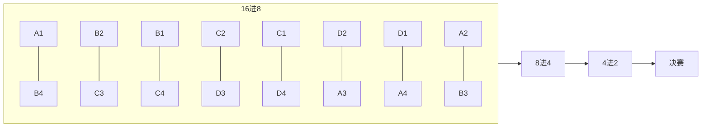

# 4.2 十六强签位表（固定，不可随机）

## 涉及模块

| 模块 | 本功能点在此的表现 |
|------|-------------------|
| BracketService | 按固定表写入 16 叶节点及后续轮次父节点 |
| 对阵树界面 | 客户端按签位顺序渲染 Bracket（见 7.2） |
| MatchService | 每场对战绑定 matchId / round / matchIndex |

> **继承 tournament_bracket R-TB-004**（`bracket_size=16`，签位不可随机）

## 功能点

**第一轮（16 进 8）8 场对阵——签位固定如下：**

| 场次 | 左位 | 右位 | 说明 |
|------|------|------|------|
| M1 | A1 | B4 | 种子保护：1 vs 4 |
| M2 | B2 | C3 | 交叉 |
| M3 | B1 | C4 | 种子保护 |
| M4 | C2 | D3 | 交叉 |
| M5 | C1 | D4 | 种子保护 |
| M6 | D2 | A3 | 交叉 |
| M7 | D1 | A4 | 种子保护 |
| M8 | A2 | B3 | 交叉 |

- **同组规避**：M1–M8 中无同周练组内战（A 与 A 不直接对阵，B 与 B 不直接对阵…）。
- **种子保护**：每组第 1 名（x1）对阵其他组第 4 名（y4）。

**第二轮（8 进 4）：**

| 场次 | 对阵 |
|------|------|
| QF1 | Winner(M1) vs Winner(M2) |
| QF2 | Winner(M3) vs Winner(M4) |
| QF3 | Winner(M5) vs Winner(M6) |
| QF4 | Winner(M7) vs Winner(M8) |

**第三轮（4 进 2 半决赛）：**

| 场次 | 对阵 |
|------|------|
| SF1 | Winner(QF1) vs Winner(QF2) |
| SF2 | Winner(QF3) vs Winner(QF4) |

**第四轮（决赛）：**

| 场次 | 对阵 |
|------|------|
| F1 | Winner(SF1) vs Winner(SF2) → 冠军 |

**推进路径示意：**



- 填充顺序：按 M1→M8 顺序写入叶子节点；胜者按上表向父节点推进。
- 不足 16 选手时按 **4.4 机器人填充规则** 补满叶节点，**不改变签位表结构**。

## 数据来源

| 读写 | 业务数据 | 程序字段 | 用途 |
|------|----------|----------|------|
| 读 | 组代号映射 | P-03 + 赛区内序号 | A/B/C/D 与 Ax 解析 |
| 读 | 选手池 | P-06、P-07 | 叶节点 slotLeft/slotRight |
| 写 | 对阵树快照 | P-10 | 15 节点完整树（8+4+2+1） |

## 怎么实现

### 通用

- 签位表为**常量/配置表**，服务端生成时**禁止随机打乱**。
- 生成后与 R-022 同组规避、种子保护校验一致；校验失败则回滚报名事务。
- 客户端只读 P-10 渲染，不参与签位计算。

### 服务端

```
报名事务内:
  解析赛区 4 组 → 映射 A/B/C/D
  for i in [M1..M8]:
    写叶节点 round=1, matchIndex=i, slotLeft/slotRight 按上表
  预创建 QF/SF/F 父节点（slot 初始为空，status=PENDING）
  不足 16 人 → 4.4 机器人填充空缺叶位
  写入 P-10 → 提交事务
```

- 每场结束：胜者 ID 写入 `parentMatchId` 对应父节点 slotLeft 或 slotRight（继承 R-TB-005）。

### 客户端

- 读 P-10 按 7.2 倒金字塔排布；叶节点顺序与 M1–M8 一致。
- 未定轮次显示 `?`；已结束轮次显示胜/负标识。

## 程序分工

| 事项 | 客户端 | 服务端 | 备注 |
| 固定签位表常量 | — | ✓ | 继承 R-TB-004 |
| 叶节点填充 | — | ✓ | M1–M8 |
| 同组/种子校验 | — | ✓ | 生成后 assert |
| 机器人补位联动 | — | ✓ | 4.4 |
| Bracket 渲染 | ✓ 读 P-10 | ✓ 下发快照 | 7.2 |
