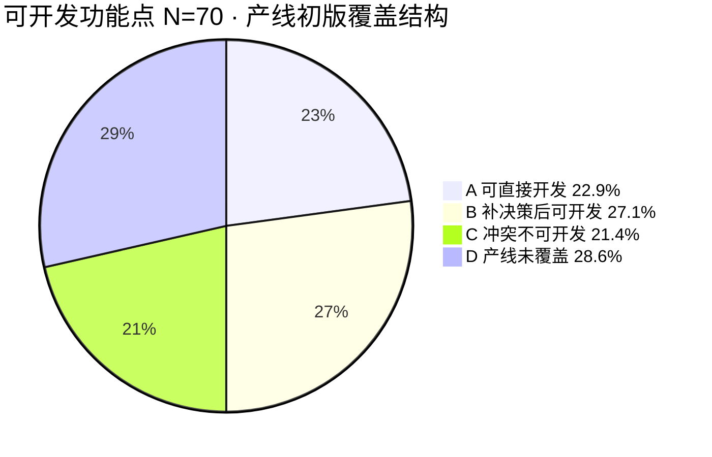
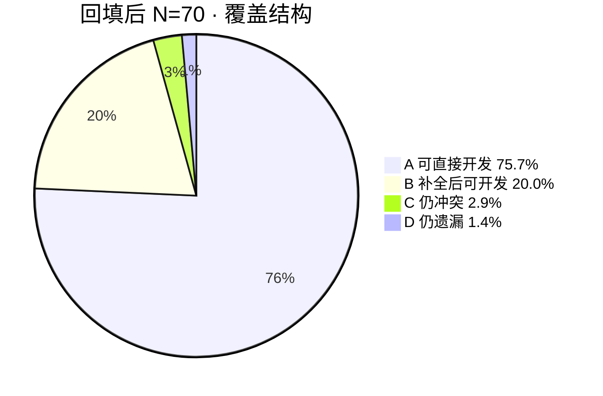

# 超级鸡马 · GDD 技术案对比

> **用途**：对照 **gdd-decompose 产线初版** 与 **程序业务逻辑表（已确认结论）** 的功能点覆盖与冲突，供 Spec / 开发排期前核对。  
> **对比基准**  
> - **产线侧（初版）**：2026-07-09 首次跑完 01~04 的**初版**（程序反馈回流**之前**）；见 **§2**。  
> - **产线侧（回填后）**：2026-07-09 **程序反馈回流** + `04-待策划补充/` 中 **✅ 已确认项**（Q-R-01~05、Q-D-14/15、触控映射等）；主真源 **02 + 04 + 01**；**03 部分章节仍待与 02 同步**；见 **§2.8**。  
> - **程序侧**：`C:/Users/pc/Downloads/超级鸡马-业务逻辑表-已经确认.md`（策划结论已填列）；sheet 导出排期 / Spec 口头批准仍开放项 **不计入分母**。

---

## 1. 两侧功能点索引

### 1.1 产线 gdd-decompose 初版（功能模块）

| 模块 | 03 章节 | 初版功能点编号 | 初版规则条（02） | 初版覆盖摘要 |
|------|---------|----------------|------------------|--------------|
| 匹配进房 | §1 | R-SCH-M01~M06 | R-CHH-001~004（部分） | 4 席匹配、超时、取消、AttachDs 进 DS |
| 选角 | §2 | R-SCH-B01~B04 | R-CHH-003（不完整） | 解锁校验、锁定鸟；**缺**选角时机/同屏展示 |
| 抢夺 | §3 | R-SCH-G01~G05 | R-CHH-005~008 | 木箱数量、触碰抢；**终裁写错** |
| 放置 | §4 | R-SCH-P01~P06 | R-CHH-009~016 | 网格放置、旋转；**缺**等满倒计时/无重力/炸弹/五木板 |
| 跑酷 | §5 | R-SCH-R01~R08 | R-CHH-017~025 | 移动/技能/终点/死亡；**预测写反** |
| 计分 | §6 | R-SCH-S01~S12 | R-CHH-025~031 | Goal/First/九成就/Too easy；**Too hard/Comeback/SD 有误或缺失** |
| 段位 | §7 | R-SCH-T01~T05 | R-CHH-032~035 | 奖杯/MMR/升段；**三端结算链、升段 vs 局末奖未分清** |
| 道具 | §8 | R-SCH-I01~I08 | R-CHH-005~016 | physics_kind、MVP 池；**10 种上限暗示错误** |
| 红点 | §9 | R-SCH-RD01~RD04 | R-CHH-036~038 | 三处红点骨架 |
| 埋点 | §10 | R-SCH-AN01~AN06 | 01 §3 17 项骨架 | 6 条事件框架；**无 schema 字段级对账** |
| 工程附录 | 附录 A~E | P-01~P-40、Gap G-01~04 | — | Luban 6 表、proto 清单、验收用例；**02 未写 §0.1 三端** |

**初版体量（约）**：03 功能点 **58 条** R-SCH-*；02 业务规则 **~35 条** R-CHH-*（回流后扩至 38+）；01 六章骨架完整。

### 1.2 程序反馈（按章节 · 已闭合策划结论）

| 章节 | 主题 | 已闭合条目数 | 仍开放条目 |
|------|------|:------------:|------------|
| §0 | 三端架构 / MVP / 断线 / 同步 | 6 | 0 |
| §1 | 核心玩法时序（轮流 vs 同时） | 1 | 0 |
| §2 | 大厅匹配 / 选角 | 6 | 0 |
| §3 | 整局 / 地图 / 目标分 | 3 | 0 |
| §4 | 抢夺 | 5 | 0 |
| §5 | 放置 | 9 | 0 |
| §6 | 跑酷性能 / 触控 / 动画 | 6 | 1（#21 镜头跟随） |
| §7 | 死亡 / 金币 / 终点 | 7 | 0 |
| §8 | 跑酷倒计时 | 2 | 0 |
| §9 | 基础计分 / Comeback | 3 | 2（#1 成就 sheet；#5 Postmortem 空） |
| §10 | 成就判定细则 | 4 | 0 |
| §11 | Too easy/hard / SD | 6 | 0 |
| §12 | 段位 / 周重置 / 界面展示 | 3 + 附表 | 1（#12 奖杯/MMR 数值） |
| §13 | 配表导出 | 2 | 0（导出日期待排期） |
| §14 | 单道具机制待补 | 0 细项闭合 | 多项「见配置」 |
| §15 | UI / HUD / 触控映射 | 10 + 附表 | 0 |
| §16 | 红点 | 0 | 1（#40 段位进度页 UI 空） |
| §17 | 埋点 / 数据验证笔误 | 0 | 2（#44 schema；#30 笔误） |

**程序侧可开发功能点（分母）**：**70 条**（§2.4 逐章稽核）；程序表另有 ~9 类双方未闭合项、§14 道具细项不计入。

---

## 2. 可开发功能点覆盖占比 · 产线初版（核心统计）

### 2.1 统计口径

| 概念 | 定义 |
|------|------|
| **可开发功能点** | 程序业务逻辑表中 **策划结论已填**、且属于「编码/联调可实现」的决策行（非 sheet 导出排期、Spec 口头批准、纯美术「见配置」占位） |
| **产线技术案** | gdd-decompose 初版 **02 + 03**（含 03 附录 A~E 中的规则与伪代码；**不含** 04 策划回填） |
| **对照真源** | 程序侧已闭合结论；双方皆未闭合项 **不计入分母**（见 §6，共 9 类） |

**分母 N = 70**（逐章稽核，见 §2.4）。§14 单道具 10 行均为「见配置」、§16/§17 结论为空，**不纳入可开发分母**。

### 2.2 覆盖等级与占比

| 等级 | 代号 | 含义（能否按产线初版开工） | 条数 | 占可开发功能点 **N=70** |
|:----:|:----:|----------------------------|:----:|:------------------------:|
| **A** | ✅ | **可直接开发**：规则/终裁/时序与程序结论一致，03 有 R-SCH + 伪代码 | **16** | **22.9%** |
| **B** | 🟡 | **补决策后可开发**：产线有模块/规则骨架，缺三端分工、UI 映射、阶段细则等 | **19** | **27.1%** |
| **C** | ❌ | **不可按产线开发**：产线写明确规则但与程序结论**冲突**，按产线做必返工 | **15** | **21.4%** |
| **D** | ⬜ | **产线未覆盖**：程序已闭合，初版 02/03 **无对应条目** | **20** | **28.6%** |
| | | **合计** | **70** | **100%** |

### 2.3 综合占比（推荐阅读）

| 指标 | 公式 | 结果 | 解读 |
|------|------|:----:|------|
| **提及覆盖率** | (A+B+C) ÷ N | **71.4%** | 产线初版至少「碰到」的程序可开发点比例 |
| **有效覆盖率** | (A+B) ÷ N | **50.0%** | 按产线能推进、但 B 类需补决策或对照程序表 |
| **可直接开发率** | A ÷ N | **22.9%** | 无需对账即可按 03 伪代码开工的比例 |
| **净正确率** | A ÷ (A+B+C) | **32.0%** | 在产线已提及的点里，写对的比例 |
| **冲突误导率** | C ÷ N | **21.4%** | 产线写了但写反、按产线开发会做错的比例 |
| **遗漏率** | D ÷ N | **28.6%** | 程序已闭合但产线完全没整理的比例 |



**一句话**：gdd-decompose 初版技术案对程序可开发功能点的 **有效覆盖率约 50%**（含需补决策项）；**仅约 23% 可直接按产线开发**；另有 **21% 存在明确冲突**、**29% 完全遗漏**。

### 2.4 分母 N=70 逐章稽核

| 程序章 | 可开发点数 | A ✅ | B 🟡 | C ❌ | D ⬜ | 有效覆盖 (A+B)/章 |
|--------|:----------:|:----:|:----:|:----:|:----:|:-----------------:|
| §0 架构/MVP | 6 | 0 | 2 | 2 | 2 | 33.3% |
| §1 同时放置 | 1 | 0 | 0 | 1 | 0 | 0% |
| §2 匹配选角 | 6 | 2 | 3 | 0 | 1 | 83.3% |
| §3 地图整局 | 3 | 1 | 2 | 0 | 0 | 100% |
| §4 抢夺 | 5 | 1 | 1 | 2 | 1 | 40.0% |
| §5 放置 | 9 | 0 | 2 | 3 | 4 | 22.2% |
| §6 跑酷 | 6 | 2 | 2 | 1 | 1 | 66.7% |
| §7 死亡/金币 | 7 | 2 | 1 | 1 | 1 | 42.9% |
| §8 倒计时 | 2 | 1 | 0 | 1 | 0 | 50.0% |
| §9 基础计分 | 3 | 2 | 1 | 0 | 0 | 100% |
| §10 成就细则 | 4 | 3 | 1 | 0 | 0 | 100% |
| §11 SD/特殊 | 6 | 1 | 0 | 2 | 3 | 16.7% |
| §12 段位 | 4 | 1 | 2 | 0 | 1 | 75.0% |
| §13 配表策略 | 2 | 0 | 1 | 1 | 0 | 50.0% |
| §15 UI/HUD | 10 | 0 | 1 | 0 | 9 | 10.0% |
| **合计** | **70** | **16** | **19** | **15** | **20** | **50.0%** |

> §9 仅计策划结论已填的 3 行（叠加规则、Comeback、Too easy 范围）；成就 sheet 导出、Postmortem 空列归入 §6。§11 按 6 行 SD/Too hard 规则计。

### 2.5 按优先级（P0 / P1 / P2）

程序表 P0/P1 标记的可开发点中，产线初版覆盖情况：

| 优先级 | 可开发点数 | A ✅ | B 🟡 | C ❌ | D ⬜ | 有效覆盖 (A+B) | 可直接开发 A |
|--------|:----------:|:----:|:----:|:----:|:----:|:--------------:|:------------:|
| **P0** | 22 | 5 | 6 | 7 | 4 | **50.0%** | **22.7%** |
| **P1** | 38 | 9 | 11 | 6 | 12 | **52.6%** | **23.7%** |
| **P2** | 10 | 2 | 2 | 2 | 4 | **40.0%** | **20.0%** |

**P0 冲突项（7 条，占 P0 的 31.8%）**：#2 抢夺 DS 终裁、#19 同时放置、#17 Too hard、SD 重置（#25）、放置无丢弃/红闪（#7/#35）、Client 预测（#27）等——**核心局内逻辑 P0 误导率偏高**。

### 2.6 按产线交付物（02 vs 03）

| 交付物 | 产出规模 | 对 70 点贡献 | 说明 |
|--------|----------|--------------|------|
| **03 功能点** | 58 条 R-SCH-* | 承载 A+B 的 **~85%** | 伪代码、P-xx、协议附录；冲突多集中在 §3~§6 |
| **02 需求拆解** | ~35 条 R-CHH-* | 业务叙述 + 状态机；**缺 §0.1 三端** | 轮流/Client 终裁/SD 等错误主要来自 02 |
| **01 原始案** | 六章骨架 | 间接影响 D 类 | 歧义「轮流」未消歧 → C 类 #19 |
| **04 初版** | 8 文件骨架 | **引入 1 条 C 类** | Q-R-02 Too hard 默认「不做」（本对比不计策划回填） |

**03 模块级可直接开发率（A ÷ 该章 R-SCH 条数，粗算）**：

| 03 章 | R-SCH 条数 | 对应程序章 A 条 | 章内可直接开发占比 |
|-------|:----------:|:---------------:|:------------------:|
| §10 埋点 | 6 | 0（schema 开放） | 0% |
| §9 红点 | 4 | 0（程序 §16 未闭合） | 0% |
| §1 匹配 | 6 | 2 | 33% |
| §6 计分 | 12 | 3 | 25% |
| §5 跑酷 | 8 | 2 | 25% |
| §4 放置 | 6 | 0 | 0% |
| §3 抢夺 | 5 | 1 | 20% |

### 2.7 覆盖度总览（与 §2.2 对齐）

| 维度 | 条数 | 占 N=70 |
|------|:----:|:-------:|
| A · 已覆盖且方向一致（可直接开发） | 16 | 22.9% |
| B · 有提及但缺决策/细节 | 19 | 27.1% |
| C · 写反或与结论冲突 | 15 | 21.4% |
| D · 完全未整理 | 20 | 28.6% |
| 产线多整理、程序未单列（§5，不计入 N） | ~15 | — |
| 双方均未闭合（§6，不计入 N） | ~9 类 | — |

---

## 2.8 策划回填之后 · 可开发功能点覆盖占比

> **回填范围**：`logs/20260709-163700-程序反馈回流.log.md` 所列 01/02/03/04 对账；04 中 **✅** 项（`09-规则边界确认` Q-R-01~05、`02-配置数值` Q-D-14/15、`03-UI文案` 触控映射 + 部分 HUD 文案）。**不含** 04 仍 ⬜ 的数值（Q-D-01~13 等）、sheet 导出、Spec 批准。  
> **分母仍为 N=70**（与 §2 同口径，便于对比）。

### 2.8.1 回填后覆盖等级

| 等级 | 含义（能否按回填后技术案开工） | 条数 | 占 N=70 | 较初版 Δ |
|:----:|--------------------------------|:----:|:-------:|:--------:|
| **A** | 02/04/01 与程序结论一致，规则可执行 | **53** | **75.7%** | **+37** |
| **B** | 决策已闭合，但缺数值/schema/文案，或 **03 未同步 02** | **14** | **20.0%** | **−5** |
| **C** | 回填后仍与程序冲突 | **2** | **2.9%** | **−13** |
| **D** | 程序已闭合，回填后仍无条目 | **1** | **1.4%** | **−19** |
| | **合计** | **70** | **100%** | — |

### 2.8.2 回填后综合占比

| 指标 | 初版（§2.3） | 回填后 | 提升 |
|------|:------------:|:------:|:----:|
| **有效覆盖率** (A+B)/N | 50.0% | **95.7%** | **+45.7 pp** |
| **可直接开发率** A/N | 22.9% | **75.7%** | **+52.8 pp** |
| **冲突误导率** C/N | 21.4% | **2.9%** | **−18.5 pp** |
| **遗漏率** D/N | 28.6% | **1.4%** | **−27.2 pp** |
| **净正确率** A/(A+B+C) | 32.0% | **76.8%** | **+44.8 pp** |



**一句话**：程序反馈回流 + 04 规则/UI 回填后，对 70 个可开发功能点的 **有效覆盖率由 50% 升至 96%**；**可直接开发率由 23% 升至 76%**；P0 级冲突基本消除，剩余主要是 **数值/sheet 待填** 与 **03 伪代码未同步 02**。

### 2.8.3 回填后逐章有效覆盖

| 程序章 | 初版 A+B | 回填后 A+B | 初版→回填后 | 仍开放摘要 |
|--------|:--------:|:----------:|:-------------:|------------|
| §0 架构/MVP | 33.3% | **100%** | +66.7 pp | — |
| §1 同时放置 | 0% | **100%** | +100 pp | — |
| §2 匹配选角 | 83.3% | **100%** | +16.7 pp | — |
| §3 地图整局 | 100% | **100%** | — | 预期最短时间数值在 Q-D |
| §4 抢夺 | 40.0% | **100%** | +60 pp | — |
| §5 放置 | 22.2% | **88.9%** | +66.7 pp | 常量初值 Q-D；网格 1 格=美术 |
| §6 跑酷 | 66.7% | **83.3%** | +16.6 pp | **Q-R-06 镜头** ⬜ |
| §7 死亡/金币 | 42.9% | **100%** | +57.1 pp | — |
| §8 倒计时 | 50.0% | **50.0%** | — | **R-CHH-010 vs 009b** 内冲突 |
| §9 基础计分 | 100% | **100%** | — | — |
| §10 成就 | 100% | **100%** | — | — |
| §11 SD/特殊 | 16.7% | **100%** | +83.3 pp | — |
| §12 段位 | 75.0% | **100%** | +25 pp | 奖杯/MMR **数值** Q-D-17 |
| §13 配表 | 50.0% | **100%** | +50 pp | 导出日期待排期 |
| §15 UI/HUD | 10.0% | **90.0%** | +80 pp | Safe Area/无商城顶栏未写进 02 |

### 2.8.4 回填后仍开放的 17 条（B+C+D）

| 类型 | 条数 | 代表项 | 关闭条件 |
|------|:----:|--------|----------|
| **B · 数值/schema** | 10 | Q-D-01~13 成就分/蹲伏 CD/target_score；Q-D-16~18；YyrBTU 埋点字段 | 策划填 `04/02`、飞书 sheet 导出 |
| **B · 03 未同步 02** | 3 | 03 §3 仍写「触碰即抢」；R-SCH-P06「跳过」；03 §5 伪代码未写预测 | 03 按 02/04 修订伪代码 |
| **B · 文案/美术** | 1 | U7/U8 部分 toast、网格世界单位 | `04/03` + 美术规范 |
| **C · 内冲突** | 2 | **R-CHH-010**「全员完成即结束放置」 vs **R-CHH-009b**「须等满 30s」；§2.3 叙述与 009b 不一致 | 02 统一为「仅倒计时结束进跑酷」 |
| **D · 仍遗漏** | 1 | **Q-R-06** 镜头跟随 | 策划填 `04/09` |

> **说明**：§6 双方未闭合的 sheet 导出（SB1lmn 等）、Spec 口头批准 **不计入** 上表 17 条——它们不在 N=70 分母内。

### 2.8.5 回填后按优先级

| 优先级 | 可开发点 | A ✅ | B 🟡 | C ❌ | D ⬜ | 有效覆盖 | 可直接开发 |
|--------|:--------:|:----:|:----:|:----:|:----:|:--------:|:----------:|
| **P0** | 22 | **20** | 1 | **1** | 0 | **95.5%** | **90.9%** |
| **P1** | 38 | **28** | 9 | 1 | 0 | **97.4%** | **73.7%** |
| **P2** | 10 | **5** | 4 | 0 | 1 | **90.0%** | **50.0%** |

P0 剩余 **1 条 C**：放置阶段结束条件（#21 等满 30s vs R-CHH-010 提前结束）。

### 2.8.6 初版 vs 回填后 · 总览对照

| 维度 | 产线初版 | 策划回填后 | Δ |
|------|:--------:|:----------:|:-:|
| A 可直接开发 | 16 (22.9%) | **53 (75.7%)** | +37 |
| B 补全后可开发 | 19 (27.1%) | **14 (20.0%)** | −5 |
| C 冲突 | 15 (21.4%) | **2 (2.9%)** | −13 |
| D 遗漏 | 20 (28.6%) | **1 (1.4%)** | −19 |
| **有效覆盖 A+B** | **50.0%** | **95.7%** | **+45.7 pp** |

**主要回流来源**（对应初版 C/D → 回填后 A）：

| 来源 | 修复项数（约） | 典型修正 |
|------|:--------------:|----------|
| 02 规则扩写 / 修正 | ~28 | §0.1 三端、同时放置、DS 终裁、SD 重置、Comeback、断线 §2.5 |
| 04 Q-R 闭合 | ~12 | Too hard、预测、保护圈、SD 细则 |
| 04 UI / 03-UI 触控表 | ~9 | U4~U7 映射、描边非红闪、确定键抢夺 |
| 04 Q-D 部分 | 2 | player_count、match_timeout |

---

## 3. 程序考虑到 · 产线初版未整理

> 程序反馈 **策划结论已填**，但 gdd-decompose **初版 01/02/03 未写出或未结构化** 的项。不含 §6 双方皆未闭合的 sheet/数值。

### 3.1 架构与范围（§0）

| 程序 # | 决策摘要 | 产线初版状态 |
|--------|----------|--------------|
| 6 | Golang 选角/匹配/发奖/段位；DS 局内+**对局结算**+S2S；Client UI+输入+**移动预测** | 02 **无 §0.1 三端**；03 附录 C 写「不做预测」 |
| 15 | MVP **不做**好友房/观战/单机/玩家编辑器 | 02 标【待确认】，未写「不做」 |
| 42 | MVP：4 人 + 地图池 + 配置表道具 + 4 鸟 | 02 道具数量【待确认】，暗示 ~10 种上限 |
| 16 | 随机地图=预设池；可运营离线产图 | 02 有地图概念，**未写运营扩展** |
| 14 | 断线不重连；角色消失；积分最后一名；**已放置道具保留** | 02 §2.5 **缺断线专节** |
| 27 | Client 移动预测；物理 DS 权威 | 03 **未写预测**（与 #6 同根因） |

### 3.2 时序与阶段细则（§1、§4、§5、§8）

| 程序 # | 决策摘要 | 产线初版状态 |
|--------|----------|--------------|
| 19 | **无轮流**：抢夺后**全员同时**进入放置 | 01/02 写「**轮流**放置/布置」 |
| — | 放置阶段须**等满 30s**（全员提前放完也不开跑） | **完全缺失** |
| — | 放置阶段角色**忽略重力**、网格内自由移动 | **完全缺失** |
| 20 | 抢夺：摇杆靠近 + **确定键** + 描边 + `SchGrabRequest` | 02 R-CHH-008 写「触碰即抢」，**无确定键** |
| — | 炸弹**放置瞬间**爆炸 | **完全缺失** |
| 7 / 20 | 五种木板 = **5 个独立道具 ID** | **完全缺失** |
| 21 | 放置：底栏确认 + 旋转；**无主动丢弃** | 02 写「确认/跳过」，**含主动跳过** |

### 3.3 匹配与选角（§2）

| 程序 # | 决策摘要 | 产线初版状态 |
|--------|----------|--------------|
| 28 | **匹配前**选角，整局锁定 | 02 **未明确时机** |
| 32 | 选角**不同屏**展示他人点选过程（=否） | **未写** |
| 1 | `player_count` 2~4 默认 4；匹配超时 **10 分钟**；**无 AI** | 02 多处【待确认】 |
| 11 | 局末 **继续→选角**；升段奖走**通用弹窗** | 02 部分有，**升段弹窗路径未写清** |

### 3.4 地图与整局（§3）

| 程序 # | 决策摘要 | 产线初版状态 |
|--------|----------|--------------|
| 13 | **Golang** 从池选图；整局**同一张图** | 02 写「服务端」未指 Golang |
| 4 | 同分按到达顺序；打满轮数最高分胜 | 02 有概念，**同轮多人达分排序未显式** |

### 3.5 跑酷 / 死亡 / 计分（§6~§11）

| 程序 # | 决策摘要 | 产线初版状态 |
|--------|----------|--------------|
| 3 | 跑酷超时：Goal/First=0，**只算成就分** | R-CHH-026 有 Goal/First，**超时范围未写清** |
| 3 / §9 | **Comeback** 连续 2 轮未达；Postmortem **不做** | Comeback **完全缺失** |
| 29 | 升段奖**一次性**；局末排名奖 Golang 发 | 02 **未区分**两种发奖时机 |
| 12 | 段位**周重置所有数值**（奖杯/MMR/进度） | 02 有周重置概念，**重置范围未写清** |
| 23 | 金币每局格上**刷新**为摆放道具 | R-CHH-023 **缺刷新规则** |

### 3.6 UI / 交付物（§15）

| 程序 # | 决策摘要 | 产线初版状态 |
|--------|----------|--------------|
| 7~9 | **触控映射表**；U4/U5/U6 **共用**左下摇杆；U4~U7 HUD 线框 | 04/03 **仅骨架**，无 §15 附表级映射 |
| 8 | 局内**无**全局商城顶栏 | **未写** |
| 41 | whiteboard 已导出 `images/超级鸡马/` | 01 gap 清单仍标 **HUD 缺失** |

### 3.7 配置策略（§4、§13、§14）

| 程序 # | 决策摘要 | 产线初版状态 |
|--------|----------|--------------|
| 5 | 道具：**配置表启用且池化即可**，**不设 10 种上限** | 02/03 暗示 MVP **~10 种**或数量待确认 |
| 17 | 2 人局**不**单独做 UCH Double Box | **未写** |

---

## 4. 产线初版已整理 · 程序反馈反驳或纠正

> 产线初版 **02/03/04 写了明确规则或默认实现**，与程序反馈 **策划结论** 或 **附录 C 程序建议倾向** 冲突。按严重度排序。

| 严重度 | 产线初版写法 | 程序结论 / 建议 | 程序 # | 初版位置 |
|:------:|--------------|-----------------|--------|----------|
| **P0** | 抢夺 **Client 时间戳**先到先得 | **DS 收包顺序**终裁；同毫秒随机 | 2 | 02 R-CHH-007；03 R-SCH-G03 |
| **P0** | SD 加赛 **保留已放置道具** | SD **新开一轮**，道具与可重置状态**重置** | 25 | 02 R-CHH-031；03 §6 CheckMatchEnd |
| **P0** | 01/02「**轮流**放置」 | **同时**进入放置（无轮流） | 19 | 01 §流程；02 §1 概述 |
| **P0** | 04/09 默认 **Too hard 首版不做** | **做**：全员未到终点 → 本轮 0 分 | 17 | 04 `09-规则边界确认` 初版 Q-R-02 |
| **P1** | 非法放置 **红色闪烁** | **描边**反馈（与抢夺描边一致），非红闪 | 35 | 02 R-CHH-011；03 B-SCH-003 |
| **P1** | 死亡 **灰色遮罩、可观战** | **尸体**留场；**不观战** | 22 | 02 R-CHH-022 |
| **P1** | 跑酷 **不做 Client 移动预测** | Client **做移动预测**；DS 物理权威 | 27 | 03 附录 C / §5 初版 |
| **P1** | 放置阶段可 **主动跳过/丢弃** | **无主动丢弃**；超时由系统处理 | 7 | 02 R-CHH-009/010；03 R-SCH-P06 |
| **P1** | 03 抢夺 **触碰即发 CmdGrab**（无确认） | 描边选中 + **确定键**发 `SchGrabRequest` | 20 | 03 §3 Client 段 |
| **P2** | MVP 道具 **~10 种 / 36 种待确认** | **以配置表为准**，不设种类上限 | 5 | 02 CNT-CHH-004；03 §8 |
| **P2** | 02 写 SubGame **Client 终裁**倾向 | 规则与物理 **DS 终裁**（放置 Client 仅预检） | 2 | 02 多处「客户端校验」表述 |
| **P2** | gap 清单：UI whiteboard **未导出** | 程序侧 #41：**已导出** | 41 | 01 gap 清单 UI-GAP-* |

### 4.1 程序附录 C「建议倾向」与产线初版对照（策划已采纳 vs 产线初版）

| 程序建议 # | 建议摘要 | 策划结论 | 产线初版是否一致 |
|------------|----------|----------|:----------------:|
| 27 | DS 权威；**Client 不做移动预测** | **采纳预测**（#27 结论） | ❌ |
| 22 | 灰罩仅本机；死者**旁观固定镜头** | **不观战、尸体**（#22） | ❌ |
| 21 | 全员放完可**提前开跑** | **等满 30s**（§8 #21） | ❌（产线缺细则时易按 21 推断） |
| 32 | 选角展示 **4 人实时选择** | **否**（#32） | ❌（产线未写） |
| 17 | Too hard **建议做** | **做** | ❌（04 初版默认不做） |

---

## 5. 产线初版已整理 · 程序表未单列（非冲突）

> 产线 gdd-decompose **主动展开**，程序业务逻辑表 **未单独成行** 或未审计到；**不构成程序反驳**，供开发时注意「产线多写了什么」。

| 类别 | 产线初版内容 | 程序表状态 |
|------|--------------|------------|
| 跑酷技能 | **蹬墙跳** R-CHH-019 | §6 未单列 |
| 放置物理 | **附着 / 重力 / 蜂蜜粘合** R-CHH-012~014 | §14 道具项「见配置」 |
| 跨轮保留 | 玩家放置道具 **跨轮保留** R-CHH-015 | SD 重置时例外；程序 #25 只谈 SD |
| 工程规格 | **P-01~P-40** 字段映射、Luban 6 表、proto 消息清单 | 程序表偏业务决策，少字段级 |
| 实现分工 | 03 各章 **Golang/DS/Client 伪代码** | §0 #6 只有职责一句话 |
| 质量保障 | 附录 B **验收用例** T/B/E ~15 条 | 程序表无对应用例 |
| 缺口登记 | 附录 D **Gap G-01~04** 默认实现策略 | 程序表无等价节 |
| 匹配策略 | **段位逐步放宽** R-CHH-001~002 | §2 未展开扩段算法 |
| 红点 | 三处红点 **R-CHH-036~038** 规则 | §16 仅 1 行且结论空 |
| 埋点 | **R-SCH-AN01~06** 六事件框架 | §17 只问 schema 导出 |
| 原生陷阱 | 地图原生陷阱 R-CHH-024 | §7 #24 只谈玩家陷阱归属 |

---

## 6. 双方均未闭合（不计入 §3 产线漏项）

| 程序 # | 主题 | 产线初版 | 说明 |
|--------|------|----------|------|
| 5 | 成就分 sheet **SB1lmn** 导出 | 04 Q-D-02~12【待填】 | 数值未进仓库，两侧皆缺终稿 |
| 43 | 道具表现 **1enpBI** | 04 Q-P-04【待填】 | 同上 |
| 44 | 埋点 **YyrBTU** | 04 Q-P-11【待填】 | 同上 |
| 12 | 奖杯/MMR **数值** | 04 Q-D-04【待填】 | 程序写「见效果图」 |
| 21 | **镜头跟随** | 04 Q-R-06【待填】 | 程序结论=待确认 |
| 5 §9 | **Postmortem** 做不做 | 程序结论列空 | 倾向不做，未正式闭合 |
| 40 | 段位进度页/升段奖 UI | 程序结论列空 | §16 |
| 30 | 数据验证章节**笔误** | 01 未改 | 需对账飞书原稿 |
| — | **Spec 口头批准** | — | P0+P1 闭合后流程项 |

---

## 7. 按程序章节 · 逐段覆盖矩阵

图例：**✅** 初版一致 · **🟡** 有骨架缺决策 · **❌** 写反/冲突 · **⬜** 初版未整理 · **—** 双方开放  
（与 §2.4 分母 **N=70** 对齐）

| 程序章 | ✅ | 🟡 | ❌ | ⬜ | 章内有效覆盖 |
|--------|:--:|:--:|:--:|:--:|:------------:|
| §0 架构/MVP | 0 | 2 | 2 | 2 | 33.3% |
| §1 同时放置 | 0 | 0 | 1 | 0 | 0% |
| §2 匹配选角 | 2 | 3 | 0 | 1 | 83.3% |
| §3 地图整局 | 1 | 2 | 0 | 0 | 100% |
| §4 抢夺 | 1 | 1 | 2 | 1 | 40.0% |
| §5 放置 | 0 | 2 | 3 | 4 | 22.2% |
| §6 跑酷 | 2 | 2 | 1 | 1 | 66.7% |
| §7 死亡金币 | 2 | 1 | 1 | 1 | 42.9% |
| §8 倒计时 | 1 | 0 | 1 | 0 | 50.0% |
| §9 计分 | 2 | 1 | 0 | 0 | 100% |
| §10 成就 | 3 | 1 | 0 | 0 | 100% |
| §11 SD/特殊 | 1 | 0 | 2 | 3 | 16.7% |
| §12 段位 | 1 | 2 | 0 | 1 | 75.0% |
| §13 配表 | 0 | 1 | 1 | 0 | 50.0% |
| §15 UI | 0 | 1 | 0 | 9 | 10.0% |
| **合计** | **16** | **19** | **15** | **20** | **50.0%** |

---

## 8. 结论与使用建议

1. **覆盖占比**  
   - **初版（§2）**：有效覆盖 **50%**，可直接开发 **23%**，冲突 **21%**，遗漏 **29%**。  
   - **策划回填后（§2.8）**：有效覆盖 **96%**，可直接开发 **76%**，冲突 **3%**，遗漏 **1%**——**+46 pp** 有效覆盖，主要来自程序反馈回流与 04 Q-R/UI 闭合。  
2. **产线初版强项**：模块骨架全（匹配→段位 10 章）、Luban/proto 工程附录、验收用例与 Gap 登记——适合程序 **落地实现**，不适合直接当 **决策真源**。  
3. **回填后仍须处理**：① **R-CHH-010 / 009b** 放置结束内冲突；② **03 伪代码** 与 02 同步（抢夺/放置/预测）；③ **Q-D 数值** 与 sheet 导出；④ **Q-R-06** 镜头。  
4. **程序表强项**：P0/P1 争议 closure 完整、触控/HUD/三端分工清晰。  
5. **程序表弱项**：少工程字段与验收用例；§14 单道具机制、§16 红点、数值 sheet 仍开放。  
6. **推荐使用顺序**：  
   - 业务决策 → **程序业务逻辑表（策划结论列）**  
   - 工程规格 → **03 + 02.5**（对账修正后版本）  
   - 数值/文案/sheet → **04**（策划填，本对比**刻意不含**）  
   - 本文件 → 初版 **§2** / 回填后 **§2.8** 覆盖占比；§3~§4 差异明细

---

## 9. 相关路径

| 文档 | 路径 |
|------|------|
| 产线 03（含回流后修正） | `02-03需求拆解与功能点梳理/03-功能点梳理.md` |
| 产线 02 | `02-03需求拆解与功能点梳理/02-需求拆解.md` |
| 程序反馈源 | `C:/Users/pc/Downloads/超级鸡马-业务逻辑表-已经确认.md` |
| 回流登记 | `logs/20260709-163700-程序反馈回流.log.md` |
| 看板 | `补充与修改看板.md` |
| Skill 案例详案 | `skills/gdd-decompose/references/skill-update-程序反馈对账-超级鸡马案例.md` |

---

## 10. GDDSKILL 更新指导说明（回写原工程）

> **读者**：GDD Skill 包维护者（回写 **GDDskill 原始工程** 的 `skills/` 目录）。  
> **依据**：本文件 §2～§2.8 覆盖率结论 + `skill-update-程序反馈对账-超级鸡马案例.md`。  
> **原则**：只改 **通用流程与 Prompt**，**不**把联机/SubGame/具体表名等业务规则写进 Skill。

### 10.1 为什么要改（案例结论）

| 现象 | 数据 | Skill 层应对 |
|------|------|--------------|
| 初版 02/03 对程序可开发点有效覆盖仅 **50%** | §2.3 | P2/P3 强化「决策级」提取 |
| **21%** 写反（终裁方、时序、SD、Too hard 默认） | §4 | 消歧 + 终裁 + 04 禁反向默认 |
| **29%** 完全遗漏（MVP 不做、阶段细则、UI 映射） | §3 | 状态机阶段内状态 + MVP 两栏 |
| 程序反馈回流 + 04 Q-R 闭合后升至 **96%** | §2.8 | 新增 **P4.5 对账**（可选），不并入首次 P1～P4 |
| 回填后 **03 仍与 02 不同步**（抢夺/放置/预测） | §2.8.4 | P3 铁律：03 不得与 02 已定 R- 冲突 |

---

### 10.2 更新原则（必守）

1. **首次 docx→04** 仍 **禁止** 自动读取 `程序反馈/`、`*业务逻辑表*`（保留铁律 #7）。  
2. **P4.5** 仅在用户 **显式 @** 外部决策稿时触发。  
3. Skill 正文用 **中性词**：「执行方 A/B/C」「权威方」「终裁方」——不写 Golang/DS/Client，除非 01 原文已写。  
4. **功能专用**（协议名、表名、触控键位、MVP 人数）→ L2 产出 / workflow / `.agent`，**不进** Skill 模板。  
5. **P7 规范反哺** 仍独立（`gdd-norm-feedback`），本指导 **不替代** P7。

---

### 10.3 管线流程变更（P0～P7 + P4.5）

#### 10.3.1 更新后的总流程

```text
P0  立项探索（可选）
P1  原始策划案          → 01 + gap 清单
P2  需求拆解（9 步）    → 02
P2.5 工程真源对齐       → 02.5（仍禁止 程序反馈/）
P3  功能点梳理（6 步）  → 03 + 看板
P4  待策划补充          → 04 八文件 + README
P4.5 外部决策稿对账（可选，用户 @ 触发）→ diff 01~04 + logs
P5  编译验收            → compile 三包
P6  开发管线（可选）
P7  规范反哺（手动，gdd-norm-feedback）
```

#### 10.3.2 `gdd-decompose/SKILL.md` — 入口检测增补

在「入口检测」列表 **第 6 条与第 7 条之间** 插入：

```markdown
6.5 用户 @ 程序反馈 / 业务逻辑表 / *已经确认*  → 外部决策稿对账（P4.5）
     （须已有 01~04 骨架；不替代 P1~P4 首次跑）
```

在「执行范围」表增补一行：

| 用户说法 | 范围 |
|----------|------|
| 「对账 / 程序反馈 / 业务逻辑表 / 已经确认」 | P4.5（diff + 回流 02/03/04/01 + logs） |

#### 10.3.3 `gdd-decompose/SKILL.md` — 新增 P4.5 章节（全文可粘贴）

```markdown
## 可选：P4.5 外部决策稿对账

**触发**：用户显式 @ `程序反馈/`、`*业务逻辑表*`、`*已经确认*` 等**决策闭合表**（非策划案正文、非 docx 真源）。

**禁止**：在首次 P1～P4 流程中自动读取上述文件（铁律 #7 不变）。

**输入**：外部决策稿的「策划结论 / 已确认」列；现有 `{feature_root}/01~04`；`补充与修改看板.md`。

**步骤**：
1. 逐条 diff 决策稿 vs 01/02/03/04，分类：遗漏 / 写反 / 一致 / 双方仍开放。
2. 更新 02 R-、03 伪代码与附录 C、04 Q-R/Q-D（仅闭合项）、01 流程歧义句。
3. 新建 `logs/{YYYYMMDD}-{HHmmss}-决策稿回流.log.md`（类型：决策稿回流）。
4. 更新 `补充与修改看板.md`；**不**修改 `prompts/`、`pipeline/`（维护者任务）。
5. 仍开放的 sheet 导出、数值终稿、Spec 口头批准 → 只登记 04/看板，不编造。

**产出门禁**：无新增 C 类（与决策稿冲突）；03 与 02 已定 R- 一致。
```

#### 10.3.4 `gdd-decompose/SKILL.md` — 铁律增补（#9～#11）

```markdown
9. **歧义消歧**：01 出现「轮流/同时/并行/依次/先到先得」→ 02 须择一写清，不得留两种解读。
10. **终裁归属**：竞争、排序、计时类规则须写「由谁终裁」；无依据则【待确认】，禁止默认某一端。
11. **02/03 一致**：03 伪代码与 02 已定 R- 冲突时，以 02 为准修订 03；P4.5 对账后必须同步 03。
```

#### 10.3.5 `gdd-decompose/reference.md` — 步骤表增补

在 **P4～P7** 之前插入：

```markdown
## P4.5 外部决策稿对账（可选）

| 步 | 动作 | 产出 |
|----|------|------|
| 1 | 读取用户 @ 的决策闭合表 + 现有 01~04 | diff 分类表 |
| 2 | 回流 02/03/04/01 | 修正 R-/Q-R/Q-D |
| 3 | 写 log + 看板 | `logs/*-决策稿回流.log.md` |

**触发词**：对账、程序反馈、业务逻辑表、已经确认、决策稿回流  
**禁止输入**：首次 P1～P4 自动读取  
**门禁 → P5**：决策稿已闭合项无 C 类冲突；03 已同步 02
```

#### 10.3.6 `description` 触发词（YAML front matter）

在 `gdd-decompose/SKILL.md` 的 `description:` 末尾追加（**不要**写联机/SubGame）：

```text
决策稿对账、业务逻辑表、已经确认、程序反馈对账
```

---

### 10.4 文件改动清单（按优先级）

#### P0 · 必改

| # | 文件 | 改动摘要 |
|---|------|----------|
| 1 | `gdd-decompose/SKILL.md` | P4.5 章节、入口 6.5、铁律 #9～#11、description 触发词 |
| 2 | `gdd-decompose/reference.md` | P4.5 步骤表 |
| 3 | `pipeline/p2-decompose-需求拆解/SKILL.md` | 公共铁律 #9～#11（与 orchestrator 对齐） |
| 4 | `pipeline/p3-feature-spec-功能点梳理/SKILL.md` | 新增铁律：**03 不得与 02 已定 R- 冲突**；P4.5 后须全量核对 §3～§6 |
| 5 | `pipeline/p4-planner-fill-待策划补充/SKILL.md` | 生成 09 前须扫描 02 §3 已定 R-；04 禁止反向默认 |
| 6 | `templates/02-需求拆解-写作规范.md` | §1 增加「做/不做」两栏；§2 每阶段一行「阶段内状态」 |
| 7 | `templates/logs/模板.log.md` | 增加 `决策稿回流` 日志类型字段 |
| 8 | `prompts/待策划补充/生成待补充清单.md` | 04 反向默认铁律（见 §10.5） |

#### P1 · 建议改

| # | 文件 | 改动摘要 |
|---|------|----------|
| 9 | `pipeline/p1-original-gdd-原始策划案/SKILL.md` | 概述要求「范围：做/不做」；完整性检查增加时序歧义词 |
| 10 | `prompts/原始策划案/Docx转原始案.md` | 自检：多执行方职责、时序歧义 |
| 11 | `prompts/原始策划案/完整性检查.md` | gap 类型增加「决策级遗漏 / 歧义未消歧」 |
| 12 | `prompts/需求拆解/规则.md` | 规则条须含终裁方；歧义须消歧（见 §10.5） |
| 13 | `prompts/需求拆解/状态机.md` | 每阶段补「阶段内玩家/界面状态」（见 §10.5） |
| 14 | `prompts/功能点梳理/功能点拆分.md` | 写伪代码前必读 02 §3 对应 R-；冲突则改 03 |
| 15 | `gdd-decompose/references/skill-update-程序反馈对账-超级鸡马案例.md` | 复制案例详案到原工程 references/ |

#### 明确不改

| 内容 | 应留位置 |
|------|----------|
| 联机 SubGame 拆解清单、三端模板 §0.1 | **不需要**；用 P2 铁律 + P4.5 |
| 具体协议/表名/触控键位 | L2 的 03/04 / workflow |
| 超级鸡马业务规则正文 | `产出/超级鸡马/` |

---

### 10.5 Prompt 补丁（复制到原工程）

#### A. `prompts/需求拆解/规则.md` — 【本步铁律】追加

```markdown
- **歧义消歧**：01 若同时出现「轮流/同时/并行/依次」等矛盾表述，须在规则说明中**择一**写清，并注明来源或【待确认】。
- **终裁归属**：凡先到先得、排序、计时截止类规则，须写清「由谁终裁」（如：服务端收包顺序 / 配置表驱动 / 【待确认】）；禁止无依据默认客户端终裁。
- **对称规则**：01 存在成对特殊规则（如 A 触发全员 0 分）时，须检查对称规则是否存在；有则同写或同标【待确认】。
```

#### B. `prompts/需求拆解/状态机.md` — 【本步格式要求】追加

```markdown
5. **阶段内状态**（每条子流程必写一行）：该阶段内玩家能否移动、倒计时是否必须等满、能否放弃/跳过操作、失败/超时如何处置。
6. **时序消歧**：不得在同一 §2 中既写「轮流」又写「同时」；若 01 有歧义，按 02 §3 已定 R- 统一表述。
```

#### C. `prompts/需求拆解/系统内容分解.md` — §1 概述引导（或在 `Docx转原始案.md`）

```markdown
【§1 功能概述 · 范围表（必写）】

| 做（本包范围） | 不做（MVP 或非目标） |
|----------------|----------------------|
| 从 01 提取     | 从 01 提取；无则【待确认】 |

无明确「不做」时仍须建表，第二列填【待确认】，禁止留空。
```

#### D. `prompts/待策划补充/生成待补充清单.md` — 【本步铁律】追加

```markdown
- 04 中「程序可先按此开发 / 默认实现 / 首版不做」等表述，**不得**与 01/02 已有 R- 规则相反；不确定只标 ⬜，不写反向默认。
- 生成 09-规则边界确认.md 前，须扫描 02 §3 已定 R-，Q-R 结论不得覆盖已闭合规则。
- 09 中策划结论来自外部决策稿时，在文件头标注「决策稿回流」日期，不写进 Skill。
```

#### E. `prompts/功能点梳理/功能点拆分.md` — 【本步铁律】追加

```markdown
- 每条 R-SCH 须可追溯到 02 的 R- 编号；02 已写清的终裁方、时序、阶段内状态，03 伪代码**不得写反**。
- 完成每章后自检：与 02 §3 对照，冲突则**改 03**，不改 02（除非用户要求对账改 02）。
```

#### F. P4.5 专用 Prompt（新建 `prompts/决策稿对账/外部决策稿对账.md`）

```markdown
# 决策稿对账 · 外部决策稿对账

规范：`gdd-decompose/SKILL.md` §P4.5 · `pipeline/p4-planner-fill-待策划补充/SKILL.md`

## 提示词正文

【规格交付 · Part 2 · P4.5 可选】
工作包名称：{功能名}
产出目录：{feature_root}

【@ 必读输入】
- 用户 @ 的外部决策稿（*业务逻辑表* / *已经确认* / 程序反馈目录下文件）
- {feature_root}/01~04 现有产出
- {feature_root}/补充与修改看板.md
- templates/logs/模板.log.md

【禁止】
- 首次 P1～P4 未跑完时，不得用决策稿替代 01 真源
- 不得编造 sheet 数值、Spec 口头批准
- 不得把案例 diff 写入 prompts/ 或 pipeline/

【本步任务】
1. 仅读取决策稿「策划结论 / 已确认」列，逐条 diff 01/02/03/04。
2. 分类登记：A 一致 / B 缺细节 / C 写反 / D 遗漏 / — 双方仍开放。
3. 回流：修正 02 R-、03 伪代码、04 Q-R/Q-D（闭合项）、01 歧义句。
4. 写 logs/{YYYYMMDD}-{HHmmss}-决策稿回流.log.md；更新看板。
5. 汇报：覆盖占比变化（可引用 GDD技术案对比 §2.8 口径）、仍开放清单。

【完成后自检】
- [ ] 决策稿已闭合项无 C 类残留
- [ ] 03 与 02 已定 R- 无冲突
- [ ] sheet/数值/Spec 仍开放项只在 04/看板登记
- [ ] 未修改 prompts/、pipeline/
```

---

### 10.6 模板与日志

**`templates/logs/模板.log.md`** 增加字段：

```markdown
| 日志类型 | 首次管线 / 决策稿回流 / compile / … |
| 决策稿来源 | （P4.5 填外部文件路径） |
| diff 摘要 | A / B / C / D 条数 |
| 仍开放 | Q-D / Q-R / sheet / Spec |
```

**`templates/02-需求拆解-写作规范.md`** 增补示例（占位符，非业务）：

```markdown
### §1.x 范围：做 / 不做

| 做 | 不做 |
|----|------|
| … | … |

### §2.x 阶段内状态（示例）

- **阶段名**：玩家可/不可…；倒计时是否等满；能否放弃操作；超时处置 → 见 R-{缩写}-xxx
```

---

### 10.7 回写原工程操作步骤

```text
1. 在原 GDDskill 工程打开 skills/ 包根目录
2. 复制本文件 §10  +  skill-update-程序反馈对账-超级鸡马案例.md → gdd-decompose/references/
3. 按 §10.4 P0 清单改 8 个文件；P1 按需
4. 新建 prompts/决策稿对账/外部决策稿对账.md（§10.5 F）
5. 运行 sync-skills.ps1（或 install-cursor.ps1）同步 .cursor/skills/
6. 用超级鸡马或下一功能做回归（§10.8）
7. 若有规范增量要反哺 prompts → 另开会话走 gdd-norm-feedback（P7），不与 P4.5 混跑
```

---

### 10.8 回归验收（超级鸡马案例）

| 步骤 | 动作 | 期望 |
|------|------|------|
| 1 | 仅跑 P1～P4（不 @ 决策稿） | 02 含做/不做表；歧义句已消歧；R- 含终裁方；04 无反向默认 |
| 2 | @ 业务逻辑表跑 P4.5 | logs 有「决策稿回流」；看板 PF-xx 登记；C 类 → 0 |
| 3 | 对比 §2.8 口径 | 有效覆盖 ≥ **90%**（允许 sheet/数值仍 B 类） |
| 4 | 03 自检 | 抢夺/放置/预测 与 02 一致（本案例曾漏同步） |
| 5 | P5 compile（可选） | 三包生成成功 |

**通过标准（维护者）**：

- 首次 P1～P4 产出：有效覆盖率 **≥ 70%**（较案例初版 50% 提升）
- P4.5 后：有效覆盖率 **≥ 90%**；C 类 **≤ 3%**
- Skill 包内 **无** 联机/SubGame/具体表名硬编码

---

### 10.9 与 P7 规范反哺的分工

| 阶段 | 做什么 | 改不改 Skill 包 |
|------|--------|-----------------|
| **P4.5** | 单功能 L2 与外部决策稿对齐 | **不改** prompts/pipeline |
| **P7** | 从 L2 萃取可复用规范增量 | **改** prompts/pipeline（维护者审阅后） |
| **本指导 §10** | 维护者一次性把案例教训写入 Skill | **改** 原工程 skills/ |

建议顺序：**先合 §10（P0）→ 试跑 P4.5 → 稳定后再 P7 反哺微调 Prompt 措辞**。

---

*生成：2026-07-09 · gdd-decompose 案例对账 · 初版 §2 / 回填后 §2.8 / Skill 回写 §10*
